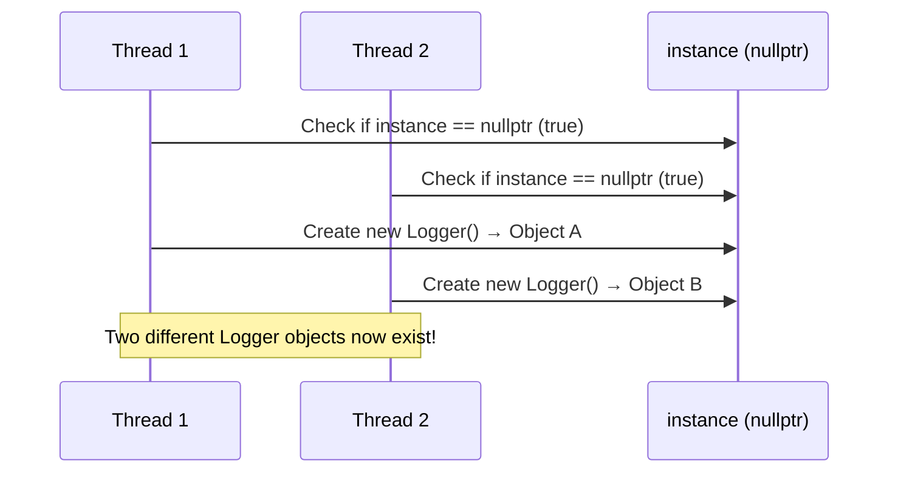
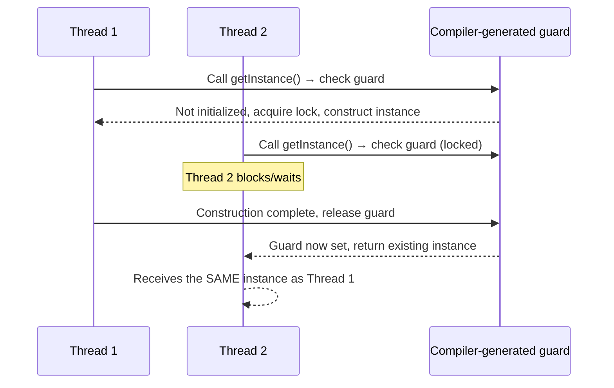

# The Singleton Pattern in Modern C++: One Instance to Rule Them All (Done Right, With C++17/20)

## Introduction: Why Does This Pattern Even Exist?

Imagine your application needs a logger. Now imagine two different parts of your codebase each create their *own* logger, each opening the *same* log file, each buffering writes independently. You end up with interleaved garbage in your log file, or worse, a file lock exception that crashes your app at 2 AM in production.

What you actually wanted was simple: **one logger, shared by everyone, created once, and guaranteed to be the same object no matter who asks for it.**

That's the entire reason the Singleton pattern exists. It's not about being clever — it's about making a promise to the rest of your codebase: *"There is exactly one of these, and I will hand you the same one every time."*

In this article, we'll build that promise from first principles, using modern C++17/C++20 features, and we'll do it the way you'd actually want it done in production — not the fragile textbook version copy-pasted from a 2009 blog post.

By the end, you'll understand:

- Why naive Singleton implementations are dangerous
- Why the "Meyers Singleton" became the de facto standard
- Why C++11 changed the rules of the game for static initialization
- How to correctly disable copying and moving
- What actually happens to your Singleton at program shutdown
- The classic interview questions asked about this pattern — and how to actually answer them well

Let's dig in.

---

## A Real-World Analogy: The Office Printer

Picture a shared office with 50 employees and **one** networked printer.

- Nobody owns the printer personally.
- Everyone accesses the *same* physical machine.
- You don't "create a new printer" every time you want to print — you send your job to the *existing* one.
- If two people click print at the same second, the printer queues the jobs; it doesn't spawn a second printer to handle the overflow.

That's a Singleton in real life: a single, shared, globally accessible resource that coordinates access rather than letting everyone spin up their own copy.

Now imagine the alternative: every employee buys their own personal printer and plugs it into the network under the same name. Chaos. Print jobs go to random printers. Nobody knows which printer has paper. That's what happens in software when you *don't* enforce a single instance for something that should conceptually be single — configuration managers, connection pools, hardware interfaces, loggers.

---

## The Problem Singleton Solves

At its core, Singleton solves **controlled global access with guaranteed uniqueness**. Specifically:

1. **Single point of coordination** — some resources are inherently one-of-a-kind (a hardware device driver, a license manager, a thread pool).
2. **Lazy initialization** — you don't want to pay the cost of creating an expensive object (like a database connection pool) until it's actually needed.
3. **Global accessibility without global variables** — you want the convenience of "reachable from anywhere" without the free-for-all mutability of a raw global.
4. **Guaranteed initialization order** — global variables across translation units have an *undefined* initialization order in C++. Singleton sidesteps this entirely (more on this below).

---

## What Goes Wrong Without a Singleton?

Let's say you don't use a Singleton and instead let every part of the codebase construct its own instance of, say, a `ConfigurationManager`.

```cpp
// file: NetworkModule.cpp
ConfigurationManager config; // Reads config.json

// file: RenderModule.cpp
ConfigurationManager config; // Reads config.json AGAIN
```

Here's what breaks:

| Problem | Consequence |
|---|---|
| Multiple reads of the same resource | Wasted I/O, wasted memory |
| Inconsistent state | One module updates a setting, the other never sees it |
| Race conditions | Two instances writing to the same log/file/socket simultaneously |
| No single source of truth | Debugging becomes a nightmare — "which config object is stale?" |
| Wasted expensive resources | Recreating DB connections, thread pools, hardware handles |

> **💡 Tip**
> Ask yourself: "Does it make conceptual sense for two of these to exist at once?" If the honest answer is no — a single hardware GPU context, a single audit log, a single app-wide settings store — Singleton is a legitimate candidate. If the answer is "well, technically, maybe," you probably don't need it.

---

## Basic Implementation (The Naive Version)

Let's start with the classic, simplest form so we can see exactly why it needs improvement.

```cpp
class Logger {
public:
    static Logger* getInstance() {
        if (instance == nullptr) {
            instance = new Logger();
        }
        return instance;
    }

    void log(const std::string& message) {
        std::cout << "[LOG]: " << message << '\n';
    }

private:
    Logger() {}                      // private constructor
    static Logger* instance;         // pointer to the single instance
};

Logger* Logger::instance = nullptr;  // definition outside the class
```

### Step-by-Step Explanation

- **`private: Logger() {}`** — The constructor is private. This is the whole trick: nobody outside the class can write `Logger obj;` because the compiler won't let them call a private constructor. The *only* door into object creation is through `getInstance()`.
- **`static Logger* instance`** — A static pointer, shared across all uses of the class rather than per-object. It starts as `nullptr` because no instance exists yet.
- **`getInstance()`** — This is a static method (callable without an object) that checks: "Do we already have an instance? If not, make one. Either way, return it."
- **`Logger::instance = nullptr;`** — Static members must be defined once outside the class in pre-C++17 code, or the linker will complain about an undefined symbol.

### Why This Naive Version Is Dangerous

This code works fine... in a single-threaded program. The moment you introduce multiple threads, you get a **race condition**:



Both threads see `instance == nullptr` at roughly the same time, and both proceed to construct an object. You now have two Loggers — the entire point of the pattern is broken, and you've also leaked memory since nobody ever calls `delete`.

> **⚠️ Warning**
> Never ship the naive lazy-initialization Singleton in multi-threaded code. It compiles fine, runs fine in testing, and then silently corrupts state in production under real concurrency. This is one of the most common real-world sources of "impossible" bugs.

---

## The Thread-Safe Meyers Singleton (The Modern Standard)

Scott Meyers popularized a beautifully simple fix, and it's the version you should actually use in modern C++:

```cpp
class Logger {
public:
    static Logger& getInstance() {
        static Logger instance;  // constructed once, on first call
        return instance;
    }

    void log(const std::string& message) const {
        std::cout << "[LOG]: " << message << '\n';
    }

    // Prevent copying and moving (explained below)
    Logger(const Logger&) = delete;
    Logger& operator=(const Logger&) = delete;
    Logger(Logger&&) = delete;
    Logger& operator=(Logger&&) = delete;

private:
    Logger() = default;
    ~Logger() = default;
};
```

### Step-by-Step Explanation

- **`static Logger instance;` inside the function** — This is a **local static variable**. It is constructed the *first time* execution reaches this line, and never again. Every subsequent call to `getInstance()` simply returns a reference to the already-constructed object.
- **Returns `Logger&` not `Logger*`** — We return a reference, not a pointer. This communicates intent clearly: this object always exists once you've called this function, there's no null-check needed, and there's no ownership being transferred (nobody should `delete` it).
- **No manual `new`, no manual `delete`** — The object lives in static storage managed entirely by the C++ runtime. This is RAII in its purest form: construction and destruction are automatic and guaranteed.
- **Deleted copy/move operations** — Explained in detail in the next two sections.

This is called the **Meyers Singleton**, and it is *thread-safe by default in C++11 and later* — no mutexes, no locks, no manual synchronization required. Let's understand exactly why.

---

## Why Local Static Variables Are Thread-Safe (C++11 and Later)

Before C++11, the C++ standard said nothing about what happens when two threads simultaneously trigger the initialization of a local static variable. Compilers were free to do whatever they wanted, and most did the naive thing — which meant a race condition, just like our first example.

**C++11 changed the language rules.** The standard now *guarantees*:

> If control enters the declaration of a local static variable while it is being initialized, the concurrently executing thread shall wait for completion of the initialization.

In plain English: the compiler inserts hidden synchronization (typically a fast atomic check plus a one-time guard, similar in spirit to `std::call_once`) around the first-time initialization of any function-local `static`. This mechanism is often referred to as **"magic statics"**.



Concretely, the compiler roughly transforms:

```cpp
static Logger instance;
```

into logic equivalent to:

```cpp
static bool initialized = false;
static std::aligned_storage_t<sizeof(Logger)> storage;
static std::mutex init_mutex; // conceptually — actual impl uses lightweight atomics

if (!initialized) {
    std::lock_guard<std::mutex> lock(init_mutex);
    if (!initialized) {
        new (&storage) Logger();
        initialized = true;
    }
}
```

This is effectively a compiler-generated, highly optimized version of the **double-checked locking pattern** — except you don't have to write it, and you don't have to get it wrong (double-checked locking written by hand is notoriously easy to get subtly wrong without `std::atomic`).

> **🎯 Interview Question**
> *"Is the Meyers Singleton thread-safe? Why?"*
> **Answer:** Yes, as of C++11. The standard guarantees that initialization of a function-local static variable is thread-safe — concurrent threads reaching the declaration during initialization will block until it completes. This is implemented via a compiler-generated guard variable, often called "magic statics." Before C++11, this was undefined behavior and required manual locking.

> **⚠️ Warning**
> This guarantee applies specifically to **function-local static variables**. It does *not* automatically apply to global/namespace-scope statics across translation units — their *relative* initialization order between different `.cpp` files is still unspecified (the "static initialization order fiasco"). This is actually another reason the Meyers Singleton (function-local static) is preferred over a plain global object.

---

## Deleting the Copy Constructor and Copy Assignment Operator

A Singleton that can be copied is not a Singleton — it's a Singleton with a stunt double.

```cpp
Logger a = Logger::getInstance(); // if copyable, this creates a SECOND Logger!
```

We prevent this explicitly:

```cpp
Logger(const Logger&) = delete;
Logger& operator=(const Logger&) = delete;
```

### Why This Matters

- **`Logger(const Logger&) = delete;`** deletes the copy constructor. Any attempt to do `Logger copy(existingLogger);` becomes a compile-time error, not a runtime surprise.
- **`Logger& operator=(const Logger&) = delete;`** deletes copy assignment. This blocks `logger1 = logger2;`.

Using `= delete` (a C++11 feature) is strictly better than the old pre-C++11 trick of declaring these as `private` and never defining them — `= delete` gives you a **clear compiler error at the call site**, rather than a cryptic linker error, or worse, silent misuse from within a member/friend function that *can* see private members.

```
error: use of deleted function 'Logger::Logger(const Logger&)'
```

Immediate, unambiguous, and self-documenting.

---

## Deleting the Move Constructor and Move Assignment Operator

It's tempting to think "well, copying is dangerous, but surely *moving* is fine — moving doesn't create a duplicate!" Let's examine why we still delete it.

```cpp
Logger(Logger&&) = delete;
Logger& operator=(Logger&&) = delete;
```

### Why Moving Is Also Forbidden

A move operation transfers the internal state of one object into another and leaves the source in a "moved-from" (often emptied) state. For a Singleton, that's catastrophic:

- If `getInstance()` returns a reference to a static object, and someone somehow moved *from* it, the single global instance would be left in a valid-but-unspecified, likely broken state — while every other holder of that reference still thinks they have a fully functional object.
- Singletons typically represent **identity**, not **value**. A `std::vector` is a value — moving it is cheap and sensible. A `Logger`, `ConfigManager`, or `HardwareManager` represents a single conceptual *entity* — moving it doesn't make sense any more than "moving" the office printer into a different printer.

> **💡 Tip**
> As a rule of thumb: if your class represents a *unique, stateful resource* rather than *data*, disable both copy and move. This communicates a strong design intent: "this object has a fixed identity and location — don't try to duplicate or relocate it."

In modern C++, you can actually collapse all four deletions into a clean idiom by deleting just the copy operations — the compiler will *not* implicitly generate move operations once you've user-declared a copy constructor/assignment (this was true even pre-C++11 in spirit, and is codified from C++11 onward). But **explicitly** deleting all four is still considered best practice because it documents intent clearly for anyone reading the header, rather than relying on implicit rule-of-five side effects.

---

## Memory Lifetime and Destruction

A common question: **when does the Meyers Singleton get destroyed?**

Function-local static objects are destroyed in the **reverse order of their completed construction**, at **program exit**, after `main()` returns (specifically, during the unwinding phase that runs registered `atexit`/static destructors).


### The "Static Destruction Order Fiasco"

If your Singleton's destructor tries to use *another* Singleton (from a different class) during its own destruction, you might be accessing an object that has *already been destroyed* — because destruction order across independently-initialized static locals in different functions/translation units is only defined relative to their *construction* order, and that's often not obvious from the code.

> **⚠️ Warning**
> Avoid having Singletons depend on each other during destruction. If `LoggerSingleton`'s destructor tries to write a final message using `FileManagerSingleton`, and `FileManagerSingleton` was already destroyed first, you get undefined behavior — often a crash on program exit that's maddening to debug because it happens *after* your visible program logic has finished.

If you truly need controlled shutdown ordering, consider explicit lifetime management (e.g., an explicit `shutdown()` method called deliberately in `main()`) rather than relying purely on static destruction order.

---

## Common Interview Questions

> **🎯 Interview Question**
> *"What design pattern category does Singleton belong to?"*
> **Answer:** Creational — it deals with object creation mechanisms.

> **🎯 Interview Question**
> *"Why is the naive lazy-initialized Singleton with a raw pointer dangerous?"*
> **Answer:** It has a race condition — two threads can both see `instance == nullptr` and both construct separate objects, breaking the single-instance guarantee and leaking memory.

> **🎯 Interview Question**
> *"How would you make a Singleton thread-safe *before* C++11?"*
> **Answer:** Manual double-checked locking with a mutex and (ideally) memory barriers/atomics, or eager initialization at program startup instead of lazy initialization.

> **🎯 Interview Question**
> *"What's the difference between Singleton and a global variable?"*
> **Answer:** Covered in detail in its own section below — short version: lazy initialization, controlled/guaranteed single construction, encapsulation, and (with effort) testability/extensibility via interfaces.

> **🎯 Interview Question**
> *"Can you subclass a Singleton?"*
> **Answer:** Technically yes, but it's awkward and rarely done well — the private constructor and static instance make normal polymorphic subclassing fight the pattern. If you need pluggable behavior, prefer dependency injection of an interface instead of inheriting from a Singleton.

> **🎯 Interview Question**
> *"Is Singleton compatible with unit testing?"*
> **Answer:** Poorly, by default. Global mutable state is one of the classic enemies of isolated, repeatable unit tests. This is a real disadvantage — discussed below.

---

## Common Mistakes Developers Make

1. **Forgetting thread safety in pre-C++11-style code** — using the raw-pointer lazy pattern without any synchronization.
2. **Returning a pointer and letting callers `delete` it** — this destroys the single shared instance out from under everyone else still using it.
3. **Not deleting copy/move operations** — silently allowing duplicate instances through copy construction.
4. **Overusing Singleton as a dumping ground** — turning it into a disguised global variable holding unrelated state ("God object" anti-pattern).
5. **Using Singleton where Dependency Injection would be cleaner** — making code untestable because collaborators can't be swapped for mocks/fakes.
6. **Assuming construction order across different Singletons** — leading to the static destruction order fiasco described above.
7. **Adding mutable public state directly** — turning your carefully controlled single instance into an uncontrolled bag of global variables that just happens to be accessed through a function call.

---

## Real-World Use Cases

| Use Case | Why Singleton Fits |
|---|---|
| **Logging systems** | All modules should write to the same log stream/file |
| **Configuration managers** | One source of truth for application settings |
| **Thread pools** | Coordinating a fixed set of worker threads app-wide |
| **Hardware/device drivers** | Physical hardware (e.g., a GPU context, a serial port) is inherently singular |
| **Caching layers** | A shared cache should not be duplicated per module |
| **Database connection pools** | Centralizing and reusing expensive connections |
| **Game engines: Resource Managers** | One authoritative registry of loaded textures/assets |

---

## Advantages

- ✅ **Guaranteed single instance** — enforced at compile time, not by convention.
- ✅ **Lazy initialization** — the object is only created when first needed, saving startup cost.
- ✅ **Thread-safe by default** in C++11+ via magic statics — no manual locking required for construction.
- ✅ **Global access point** without exposing a raw mutable global variable.
- ✅ **Automatic, RAII-based cleanup** — no manual `delete`, no memory leaks from the instance itself.

## Disadvantages

- ❌ **Hidden dependencies** — code that calls `Logger::getInstance()` doesn't declare that dependency in its interface (constructor/parameters), making the dependency graph implicit and harder to reason about.
- ❌ **Testing difficulty** — global mutable state persists across unit tests unless carefully reset, causing test pollution and order-dependent failures.
- ❌ **Tight coupling** — code directly calling a concrete Singleton class is coupled to that exact implementation; swapping it for a mock/fake in tests is hard without an interface layer.
- ❌ **Overuse risk** — it's tempting to make *everything* a Singleton, leading to a codebase full of interdependent global state (sometimes called "Singletonitis").
- ❌ **Destruction order is not fully controllable**, as discussed above.
- ❌ **Concurrency of *use*, not just construction, still needs your attention** — thread-safe *creation* doesn't mean thread-safe *usage*; if multiple threads call methods on the Singleton that mutate shared state, you still need your own internal synchronization (mutexes, atomics) inside those methods.

> **⚠️ Warning**
> Thread safety of `getInstance()` and thread safety of the *object's methods* are two completely different things. The Meyers Singleton only guarantees the former.

---

## When NOT to Use Singleton

- When you need **multiple configurations** of the same conceptual object (e.g., multiple independent loggers writing to different files) — that's not a Singleton use case at all, just a normal class.
- When it's primarily being used to **avoid passing parameters** through several layers of function calls out of laziness — that's a design smell; consider dependency injection instead.
- When **unit testability** is a high priority and you can't easily mock/reset the Singleton between tests.
- When the "single instance" requirement is really just **today's assumption** and might not hold in the future (e.g., "we'll only ever have one database connection" — until you need read replicas).
- In **highly concurrent systems** where a single shared instance becomes a bottleneck (lock contention) — sometimes sharded or per-thread instances scale better.

---

## Singleton vs. Global Variable

This is one of the most common points of confusion, so let's be precise.

| Aspect | Global Variable | Singleton |
|---|---|---|
| **Initialization timing** | At program/static init time (or per translation-unit order — order across TUs is unspecified) | Lazy — on first actual use |
| **Encapsulation** | None — directly exposed, freely mutable from anywhere | Controlled — access mediated through a method, internal state can be private |
| **Thread-safety of creation** | Not automatically synchronized across TUs (order fiasco risk) | Guaranteed thread-safe construction (C++11+, function-local static) |
| **Extensibility** | None — it's just a variable | Can implement an interface, allow controlled subclassing, add validation logic in accessor |
| **Testability** | Very poor | Poor, but improvable (interface + injectable "mock instance" pattern) |
| **Explicit dependency signaling** | None | None (this is a shared weakness) |
| **Guarantee of uniqueness** | Only by convention/discipline | Enforced by the compiler (deleted copy/move, private constructor) |

**Bottom line:** A Singleton is best understood as a *global variable with guardrails* — same reach, but with construction control, encapsulation, and explicit intent. It solves the *initialization order* and *accidental duplication* problems that raw globals don't, but it inherits the *hidden dependency* and *testability* problems that all global state has.

---

## Production-Quality Implementation

Here's a version suitable for real production code — templated for reuse, `noexcept`-correct where applicable, and documented.

```cpp
#pragma once
#include <mutex>
#include <string>
#include <iostream>
#include <fstream>

/// Thread-safe, lazily-initialized Singleton Logger.
/// Not copyable, not movable. Automatically destroyed at program exit.
class Logger {
public:
    /// Returns a reference to the single, shared Logger instance.
    /// Thread-safe: construction is synchronized via C++11 "magic statics".
    static Logger& getInstance() noexcept {
        static Logger instance;
        return instance;
    }

    /// Thread-safe logging method — internally synchronized
    /// because multiple threads may call this concurrently.
    void log(const std::string& message) {
        std::lock_guard<std::mutex> lock(mutex_);
        std::cout << "[LOG]: " << message << '\n';
    }

    Logger(const Logger&)            = delete;
    Logger& operator=(const Logger&) = delete;
    Logger(Logger&&)                 = delete;
    Logger& operator=(Logger&&)      = delete;

private:
    Logger()  = default;
    ~Logger() = default;

    std::mutex mutex_; // protects concurrent calls to log()
};
```

### What Changed vs. the Basic Version — and Why

- **`noexcept` on `getInstance()`** — construction of a `Logger` here can't throw (its members are trivial to construct), so we advertise that guarantee to callers, which can enable compiler optimizations and clearer contracts.
- **Internal `std::mutex mutex_`** — this is the piece beginners often miss. The *creation* of the Singleton is thread-safe automatically, but the *use* of shared mutable state inside its methods (here, writing to `std::cout`) is not — we protect that ourselves with a `lock_guard`.
- **`#pragma once`** — standard modern header-guard practice.
- **Private, defaulted destructor** — explicit and intentional, documenting that this class manages its own lifetime and shouldn't be destroyed manually.

> **💡 Tip**
> A useful generalization is a reusable `Singleton<T>` CRTP base class so you don't repeat this boilerplate for every class that needs the pattern. Just be cautious: templated Singleton bases can obscure intent and make debugging harder for newcomers to the codebase — use them only if you have several genuine Singletons.

---

## Complete Compilable C++ Example

```cpp
#include <iostream>
#include <mutex>
#include <string>
#include <thread>
#include <vector>

class Logger {
public:
    static Logger& getInstance() noexcept {
        static Logger instance;
        return instance;
    }

    void log(const std::string& message) {
        std::lock_guard<std::mutex> lock(mutex_);
        std::cout << "[Thread " << std::this_thread::get_id()
                   << "] " << message << '\n';
    }

    Logger(const Logger&)            = delete;
    Logger& operator=(const Logger&) = delete;
    Logger(Logger&&)                 = delete;
    Logger& operator=(Logger&&)      = delete;

private:
    Logger()  = default;
    ~Logger() = default;

    std::mutex mutex_;
};

void worker(int id) {
    Logger& logger = Logger::getInstance();
    logger.log("Worker " + std::to_string(id) + " started");
    logger.log("Worker " + std::to_string(id) + " finished");
}

int main() {
    std::cout << "Address of instance from main: "
              << &Logger::getInstance() << "\n\n";

    std::vector<std::thread> threads;
    for (int i = 1; i <= 4; ++i) {
        threads.emplace_back(worker, i);
    }

    for (auto& t : threads) {
        t.join();
    }

    std::cout << "\nAddress of instance again: "
              << &Logger::getInstance() << '\n';
    std::cout << "Notice: same address every time.\n";

    return 0;
}
```

### Output

```
Address of instance from main: 0x55d2f3a1c040

[Thread 140234872735296] Worker 1 started
[Thread 140234872735296] Worker 1 finished
[Thread 140234864342592] Worker 2 started
[Thread 140234864342592] Worker 2 finished
[Thread 140234855949888] Worker 3 started
[Thread 140234855949888] Worker 3 finished
[Thread 140234847557184] Worker 4 started
[Thread 140234847557184] Worker 4 finished

Address of instance again: 0x55d2f3a1c040
Notice: same address every time.
```

> **📝 Note**
> Exact thread IDs and memory addresses will differ on your machine and between runs — that's expected. The key detail to verify is that the address printed at the start and the address printed at the end are **identical**, proving it's the same object throughout, and that log lines from concurrent threads don't interleave mid-line (thanks to `mutex_`).

---

## Time Complexity

Singleton is a structural/creational pattern, not an algorithm, so classical Big-O analysis doesn't apply in the traditional sense — but it's worth being precise about *cost*, since that's really what people mean when they ask this in interviews:

| Operation | Cost |
|---|---|
| First call to `getInstance()` | O(1) amortized — pays the one-time construction cost of `Logger` |
| Every subsequent call to `getInstance()` | O(1) — a guard check (implemented via an atomic flag) plus a reference return |
| `log()` call | O(1) plus lock acquisition cost (uncontended `std::mutex` lock/unlock is very fast — typically tens of nanoseconds) |

> **🎯 Interview Question**
> *"What's the time complexity of calling `getInstance()` a thousand times?"*
> **Answer:** Still effectively O(1) per call after the first — the guard check for an already-initialized magic static is just an atomic load, extremely cheap, not a linear scan or anything proportional to call count.

---

## FAQ

**Q: Is Meyers Singleton the only thread-safe way to write a Singleton in C++?**
No. You could also use `std::call_once` with a `std::once_flag`, or eager static initialization at namespace scope. But the Meyers Singleton is simpler, equally safe, and lazily initialized, which is why it's the standard recommendation.

**Q: Can I have Singleton with constructor arguments?**
Not cleanly through `getInstance()` with no arguments — that defeats "call it anywhere, get the same thing" simplicity. A common workaround is a separate, explicitly-called `initialize(config)` method invoked once at startup, with `getInstance()` afterward simply returning the already-configured object (and asserting/throwing if called before initialization).

**Q: Does `static Logger instance;` inside `getInstance()` get placed on the heap or the stack?**
Neither, exactly — it lives in **static storage duration** memory (not the call stack, and not dynamically `new`'d on the heap), managed by the runtime for the entire remaining life of the program after first construction.

**Q: What happens if `getInstance()` is called from multiple DLLs/shared libraries?**
This is a real, tricky pitfall — each shared library may get its *own* static instance if the class isn't properly exported, silently breaking the "single instance" guarantee across module boundaries. Handle with care in plugin-based architectures.

**Q: Is Singleton the same as a "static class" with only static methods?**
No. A static-methods-only class has no object identity at all — no constructor runs, no instance exists, no polymorphism is possible. A Singleton is a genuine object with exactly one instance, which can implement interfaces, hold non-static state, and be passed by reference.

**Q: Should I use Singleton or a Dependency Injection container in a large codebase?**
For large, testable, evolving codebases, prefer Dependency Injection (passing shared instances explicitly into constructors) over Singleton. Reserve Singleton for cases with a genuinely unique, low-level, cross-cutting resource where explicit injection everywhere would be excessive ceremony (e.g., a low-level logging facility).

---

## Key Takeaways

- Singleton guarantees **exactly one instance** with a **global access point**, solving real coordination problems for inherently unique resources.
- The **naive raw-pointer version is unsafe** under concurrency — never ship it.
- The **Meyers Singleton** (function-local `static`) is the modern standard: simple, lazy, and thread-safe by the C++11 standard's "magic statics" guarantee.
- **Always delete copy and move operations** — a Singleton that can be duplicated or relocated isn't really a Singleton.
- Thread-safe **construction** does not imply thread-safe **usage** — protect mutable state inside your methods separately.
- Understand the **static destruction order** risk when Singletons interact with each other during shutdown.
- Singleton is a **global variable with guardrails** — better than a raw global, but it still carries real downsides: hidden dependencies and reduced testability.
- Use it deliberately, for genuinely unique resources — not as a shortcut to avoid passing parameters.

---

## Conclusion

The Singleton pattern gets a mixed reputation in the C++ community — some call it an anti-pattern outright. The truth is more nuanced: **Singleton is a sharp tool**. Used for the right problem — a hardware resource, a logging facility, a resource manager that genuinely has one instance for the life of the program — it's clean, safe, and efficient in modern C++. Used as a lazy substitute for proper dependency management, it becomes a source of hidden coupling and testing pain.

The good news is that modern C++ (C++11 through C++20) gives you everything you need to implement it *correctly*: guaranteed thread-safe static initialization, `= delete` for explicit intent, and RAII-driven cleanup with zero manual memory management. If you're going to reach for Singleton, reach for the Meyers version, delete your copy/move operations, protect your internal mutable state, and use it sparingly and intentionally.

That's the difference between a Singleton that quietly does its job for years, and one that becomes the thing everyone's afraid to refactor.

---

*Got a favorite Singleton war story — a bug it caused, or a problem it elegantly solved? Drop it in the comments. I read every one.*