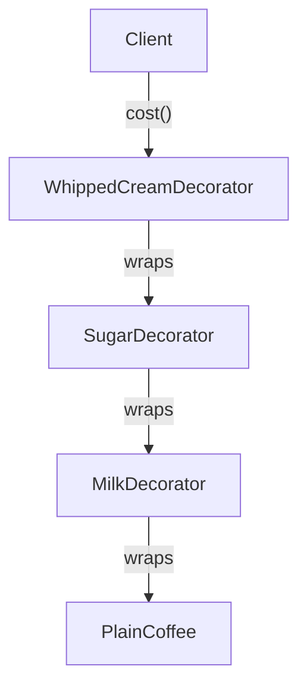
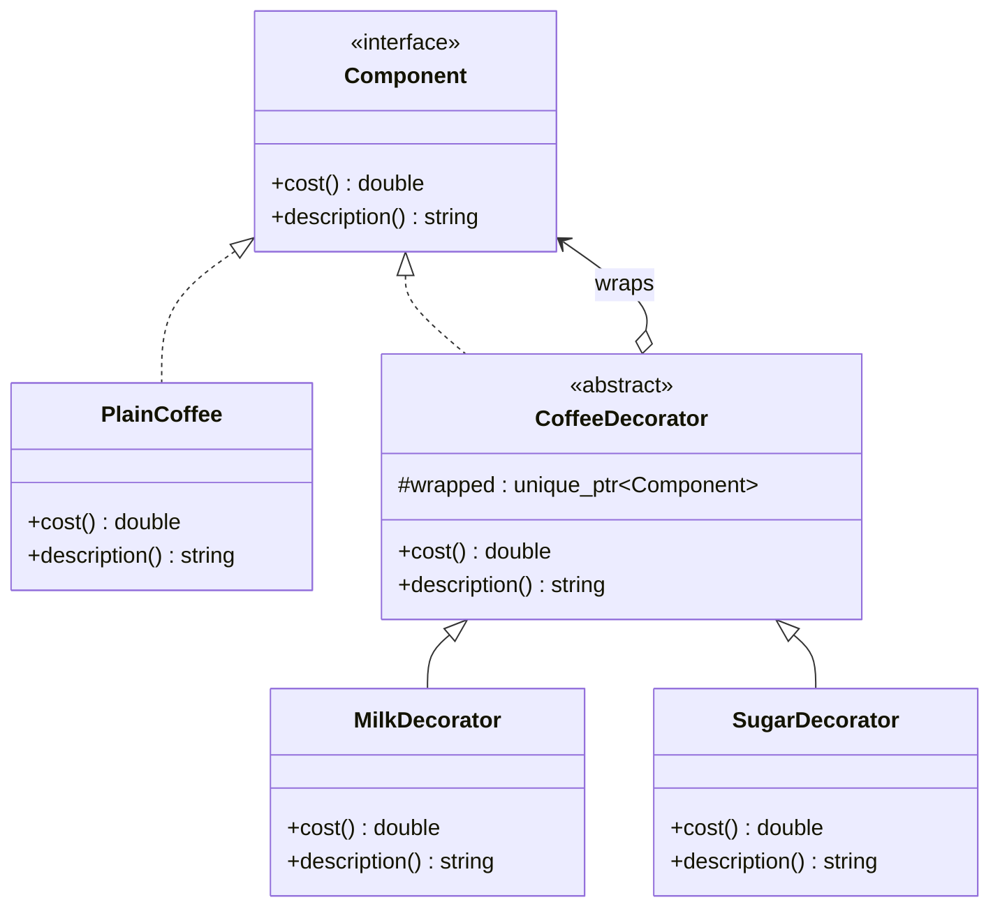
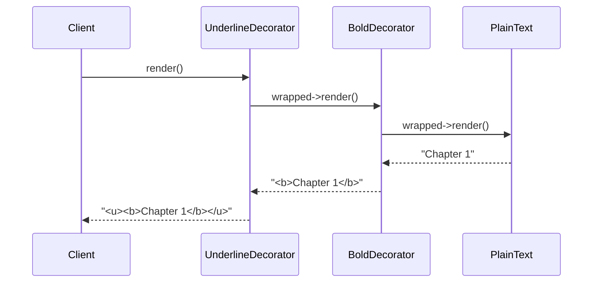
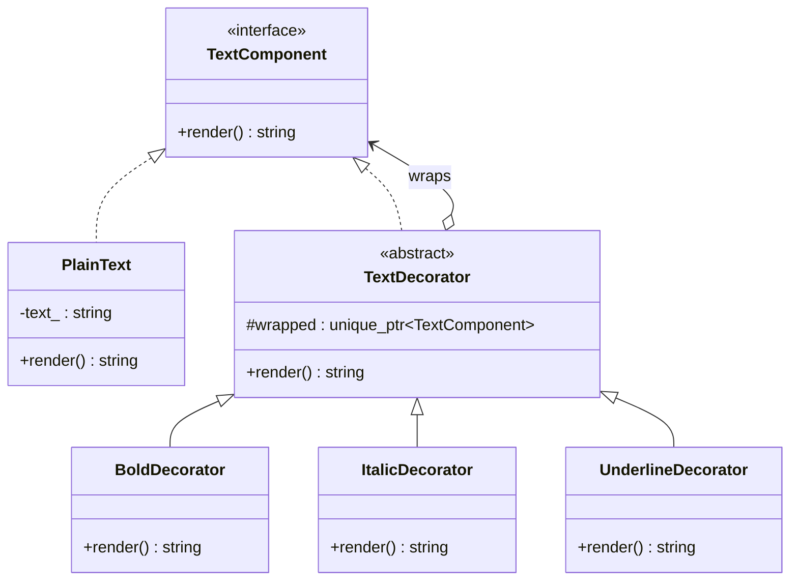

# Understanding the Decorator Pattern in Modern C++ — Add Superpowers to Objects Without Touching Their Code

---

## 1. Introduction: Why Do We Need to "Add Features" Without Editing the Original Class?

Imagine you're building a coffee shop ordering app.

You start simple:

```cpp
class Coffee {
public:
    double cost() { return 2.0; }
};
```

Then the requirements start rolling in:

- Some customers want milk (+$0.5)
- Some want sugar (+$0.2)
- Some want whipped cream (+$0.7)
- Some want milk **and** sugar **and** whipped cream
- Some want double milk

If your first instinct is "I'll just add a bunch of boolean flags to `Coffee`," you're about to open a door you can't easily close. Every new topping means editing the `Coffee` class again, and the number of possible combinations explodes.

This is exactly the problem the **Decorator Pattern** was built for: **how do you add new behavior or responsibilities to an individual object, at runtime, without editing its class — and without creating a new subclass for every possible combination?**

You'll bump into this problem constantly:

- Coffee shop toppings (milk, sugar, cream — in any combination)
- Text editors applying Bold, Italic, and Underline formatting together
- Pizza toppings
- Gift wrapping — box, ribbon, wrapping paper, greeting card, all optional and stackable
- Video game character buffs — armor, shield, speed boost, all stacking on top of a base character

Let's build this up the way a mentor would — starting from the mess, ending at the clean, modern C++ solution.

---

## 2. A Real-World Analogy: Ordering a Custom Coffee

Think about how a real coffee shop actually works.

- You start with a **base drink** — plain black coffee.
- You can **wrap** it with milk. Now it's "coffee with milk," but it's still fundamentally a drink you can hand to the next station.
- You can **wrap** that with sugar. Now it's "coffee with milk and sugar" — still just a drink.
- You can **wrap** that with whipped cream. Now it's "coffee with milk, sugar, and whipped cream."

At every step, the barista doesn't need a brand-new recipe card for every possible combination of toppings. Instead, each topping is a **layer** wrapped around whatever came before it — and each layer knows two things: what's underneath it, and what it personally adds (in cost, in taste, in calories).


> The **base coffee** never gets modified. Every topping just **wraps around** whatever exists so far, adding its own little bit of behavior on top.

That's the entire Decorator Pattern in one sentence: **wrap an object in layers, where each layer adds new behavior while still behaving like the original thing.**

---

## 3. The Problem, Without Decorator

Let's see the "obvious but bad" way most beginners try first: a subclass for every combination.

```cpp
class Coffee {
public:
    virtual double cost() { return 2.0; }
    virtual ~Coffee() = default;
};

class CoffeeWithMilk : public Coffee {
public:
    double cost() override { return 2.5; }
};

class CoffeeWithMilkAndSugar : public Coffee {
public:
    double cost() override { return 2.7; }
};

class CoffeeWithMilkSugarAndCream : public Coffee {
public:
    double cost() override { return 3.4; }
};

// What about Coffee with just Sugar?
// What about Coffee with Cream and Sugar but no Milk?
// What about DOUBLE milk?
```

This "looks" fine for a moment... until you realize you need a new class for every single combination of toppings.

---

## 4. Why This Becomes a Problem

| Problem | What Actually Happens |
|---|---|
| **Class explosion** | 3 toppings means up to 8 possible combinations. 5 toppings means 32. You'd need a subclass for nearly every one. |
| **Rigid, compile-time only** | You can't decide "add whipped cream" *while the program is running* based on user input — it's baked into which class you picked. |
| **Code duplication** | `CoffeeWithMilkAndSugar` and `CoffeeWithMilkSugarAndCream` both re-implement the "has milk" logic separately. |
| **Difficult extension** | Adding a brand-new topping (say, caramel) means potentially doubling your existing subclass count to cover every combination with caramel too. |
| **Violates Open/Closed Principle** | You constantly need to touch existing code (or add whole new classes) instead of simply composing existing pieces together. |

> **⚠️ Warning**
> The moment you find yourself naming a class `CoffeeWithMilkAndSugarButNoCream`, that's the universe telling you: stop subclassing for combinations, start **wrapping**.

---

## 5. Introducing the Decorator Pattern

**Definition:** Decorator is a structural design pattern that lets you attach new behaviors to individual objects dynamically, by placing these objects inside special "wrapper" objects that contain the added behavior — without altering the original object's class.

**Intent:** Add responsibilities to an object at runtime, as a flexible alternative to subclassing for every combination of features.

**Core idea, in plain words:**

> "Don't rebuild the object with new features baked in — wrap the object, one layer at a time, and let each wrapper add its own little bit."

Every decorator **is-a** version of the same base thing it's wrapping (that's the key trick), so you can stack decorators on top of decorators, and the outermost layer still behaves exactly like a plain `Coffee` as far as anyone calling it is concerned.



---

## 6. The Structure of the Decorator Pattern

| Role | Job |
|---|---|
| **Component** (interface) | Declares the common interface for both plain objects and decorated ones (e.g., `cost()`). |
| **ConcreteComponent** | The original, "plain" object with no extra behavior (e.g., `PlainCoffee`). |
| **Decorator** (abstract base) | Implements the same interface as `Component`, and internally holds a reference/pointer to a wrapped `Component`. |
| **ConcreteDecorator** | Adds its own specific behavior, then delegates the rest to the object it's wrapping (e.g., `MilkDecorator`, `SugarDecorator`). |
| **Client** | Wraps objects in whichever decorators it wants, in whichever order, at runtime. |



---

## 7. Step-by-Step: The Simplest Possible Implementation

Let's write the smallest version that actually works, explaining every single line.

```cpp
#include <iostream>
#include <memory>
#include <string>

// 1. The Component interface — the common "shape" every coffee (plain or decorated) must have.
class Coffee {
public:
    virtual double cost() const = 0;
    virtual std::string description() const = 0;
    virtual ~Coffee() = default;
};

// 2. The ConcreteComponent — the plain, undecorated object.
class PlainCoffee : public Coffee {
public:
    double cost() const override { return 2.0; }
    std::string description() const override { return "Coffee"; }
};

// 3. The abstract Decorator — also a Coffee, but it WRAPS another Coffee.
class CoffeeDecorator : public Coffee {
public:
    explicit CoffeeDecorator(std::unique_ptr<Coffee> coffee)
        : wrapped(std::move(coffee)) {}

protected:
    std::unique_ptr<Coffee> wrapped; // the object being wrapped
};

// 4. A ConcreteDecorator — adds milk, then delegates the rest to whatever it wraps.
class MilkDecorator : public CoffeeDecorator {
public:
    explicit MilkDecorator(std::unique_ptr<Coffee> coffee)
        : CoffeeDecorator(std::move(coffee)) {}

    double cost() const override {
        return wrapped->cost() + 0.5; // add my own cost, then ask the layer underneath
    }

    std::string description() const override {
        return wrapped->description() + " + Milk";
    }
};

// 5. Another ConcreteDecorator — adds sugar.
class SugarDecorator : public CoffeeDecorator {
public:
    explicit SugarDecorator(std::unique_ptr<Coffee> coffee)
        : CoffeeDecorator(std::move(coffee)) {}

    double cost() const override {
        return wrapped->cost() + 0.2;
    }

    std::string description() const override {
        return wrapped->description() + " + Sugar";
    }
};

int main() {
    // Start plain, then wrap, wrap, wrap.
    std::unique_ptr<Coffee> order = std::make_unique<PlainCoffee>();
    order = std::make_unique<MilkDecorator>(std::move(order));
    order = std::make_unique<SugarDecorator>(std::move(order));

    std::cout << order->description() << " = $" << order->cost() << "\n";
    // Output: Coffee + Milk + Sugar = $2.70

    return 0;
}
```

### Line-by-line, like a mentor would explain it

- `class Coffee` — the **contract**. Both plain coffee and every decorated version must be able to answer `cost()` and `description()`.
- `class PlainCoffee : public Coffee` — the actual starting point, with no wrapping at all. This is your base drink.
- `class CoffeeDecorator : public Coffee` — notice it **also implements `Coffee`**. This is the magic trick of the pattern: a decorator *is a* `Coffee` too, which means you can wrap a decorator in another decorator, and the client never has to know or care how many layers deep it goes.
- `std::unique_ptr<Coffee> wrapped;` — this is the "what's underneath me" reference. Every decorator holds on to exactly one wrapped `Coffee`.
- `MilkDecorator::cost()` — this is the heart of the pattern: **add my own bit (`+ 0.5`), then ask whatever I'm wrapping for the rest (`wrapped->cost()`)**. It never needs to know if it's wrapping a `PlainCoffee` or five other decorators deep — polymorphism handles that.
- In `main()`, notice the client builds the object **at runtime**, one `std::move()` at a time — nobody had to write a `CoffeeWithMilkAndSugar` class in advance.

---

## 8. Leveling Up: The Modern C++ Version

The version above already uses `std::unique_ptr`, which is a big step up from raw pointers — but let's talk about *why* that specific choice matters, and tighten a few more things using modern C++ idioms.

```cpp
#include <iostream>
#include <memory>
#include <string>
#include <utility>

class Coffee {
public:
    [[nodiscard]] virtual double cost() const = 0;
    [[nodiscard]] virtual std::string description() const = 0;
    virtual ~Coffee() = default;
};

class PlainCoffee final : public Coffee {
public:
    [[nodiscard]] double cost() const override { return 2.0; }
    [[nodiscard]] std::string description() const override { return "Coffee"; }
};

class CoffeeDecorator : public Coffee {
public:
    explicit CoffeeDecorator(std::unique_ptr<Coffee> coffee) noexcept
        : wrapped(std::move(coffee)) {}

protected:
    std::unique_ptr<Coffee> wrapped;
};
```

### Why every choice here matters

- **`std::unique_ptr<Coffee>` for ownership** — each decorator is the *sole* owner of the coffee it wraps. There's no shared ownership needed here (unlike Observer's subscriber list) because the wrapping chain is strictly linear — one owner per link, like a chain of Russian nesting dolls. `unique_ptr` communicates that clearly and costs nothing at runtime.
- **`std::move(coffee)` in the constructor** — since `unique_ptr` can't be copied (only moved), this transfers ownership from whoever called the constructor *into* the decorator. The caller can no longer use their original pointer — full, exclusive ownership handoff, exactly matching the real-world idea of "wrapping" an object.
- **`[[nodiscard]]`** — this tells the compiler (and the next developer) "don't call `cost()` and throw away the result — that's almost certainly a bug." A small thing, but it catches real mistakes.
- **`final` on `PlainCoffee`** — this class isn't meant to be a base for further inheritance; only `Coffee` (the interface) should be extended, either by more concrete components or by decorators. Marking it `final` documents that intent and lets the compiler enforce it.
- **`noexcept` on the constructor** — moving a `unique_ptr` can't throw, so we can honestly promise this constructor won't throw either.

> **💡 Tip**
> A useful trick: since every decorator's constructor just takes and stores a `unique_ptr<Coffee>`, you rarely need to repeat that boilerplate — `CoffeeDecorator`'s constructor handles it once, and every concrete decorator just calls the base constructor.

---

## 9. Complete, Production-Ready Example: A Text Formatting Pipeline

Let's use a different, equally relatable scenario: formatting text in an editor, where **Bold**, *Italic*, and <u>Underline</u> can each be applied independently and stacked in any order — a textbook real-world use of Decorator.

```cpp
#include <iostream>
#include <memory>
#include <string>
#include <utility>

// ---------- Component ----------
class TextComponent {
public:
    [[nodiscard]] virtual std::string render() const = 0;
    virtual ~TextComponent() = default;
};

// ---------- ConcreteComponent ----------
class PlainText final : public TextComponent {
public:
    explicit PlainText(std::string text) : text_(std::move(text)) {}

    [[nodiscard]] std::string render() const override {
        return text_;
    }

private:
    std::string text_;
};

// ---------- Decorator base ----------
class TextDecorator : public TextComponent {
public:
    explicit TextDecorator(std::unique_ptr<TextComponent> component) noexcept
        : wrapped(std::move(component)) {}

protected:
    std::unique_ptr<TextComponent> wrapped;
};

// ---------- ConcreteDecorators ----------
class BoldDecorator final : public TextDecorator {
public:
    using TextDecorator::TextDecorator;

    [[nodiscard]] std::string render() const override {
        return "<b>" + wrapped->render() + "</b>";
    }
};

class ItalicDecorator final : public TextDecorator {
public:
    using TextDecorator::TextDecorator;

    [[nodiscard]] std::string render() const override {
        return "<i>" + wrapped->render() + "</i>";
    }
};

class UnderlineDecorator final : public TextDecorator {
public:
    using TextDecorator::TextDecorator;

    [[nodiscard]] std::string render() const override {
        return "<u>" + wrapped->render() + "</u>";
    }
};

// ---------- Client ----------
std::unique_ptr<TextComponent> applyFormatting(
    std::unique_ptr<TextComponent> text, bool bold, bool italic, bool underline) {

    if (bold) {
        text = std::make_unique<BoldDecorator>(std::move(text));
    }
    if (italic) {
        text = std::make_unique<ItalicDecorator>(std::move(text));
    }
    if (underline) {
        text = std::make_unique<UnderlineDecorator>(std::move(text));
    }
    return text;
}

int main() {
    std::unique_ptr<TextComponent> heading = std::make_unique<PlainText>("Chapter 1");
    heading = applyFormatting(std::move(heading), /*bold=*/true, /*italic=*/false, /*underline=*/true);
    std::cout << heading->render() << "\n";
    // Output: <u><b>Chapter 1</b></u>

    std::unique_ptr<TextComponent> quote = std::make_unique<PlainText>("Stay curious.");
    quote = applyFormatting(std::move(quote), /*bold=*/false, /*italic=*/true, /*underline=*/false);
    std::cout << quote->render() << "\n";
    // Output: <i>Stay curious.</i>

    return 0;
}
```

Notice something important here: **the user decides the formatting combination at runtime** (via booleans that could easily come from a UI checkbox), and we never had to write a `BoldItalicUnderlinePlainText` class. Every combination is just a different stacking order of the same small set of decorators.

---

## 10. Execution Flow: What Actually Happens, Step by Step

1. **Create base component** — `std::make_unique<PlainText>("Chapter 1")` builds the innermost, undecorated object.
2. **Wrap, layer by layer** — each call to `std::make_unique<BoldDecorator>(std::move(text))` takes ownership of whatever came before it and produces a new outer object.
3. **Ownership transfers each time** — after `std::move(text)`, the previous `unique_ptr` is empty; only the new, outer decorator owns the whole chain now.
4. **Client calls `render()` on the outermost layer** — it doesn't know or care how many layers are inside.
5. **Each layer does its bit, then delegates** — `UnderlineDecorator::render()` wraps `<u>` around whatever `BoldDecorator::render()` returns, which itself wraps `<b>` around whatever `PlainText::render()` returns.
6. **Destruction cascades automatically** — when the outermost `unique_ptr` goes out of scope, its destructor runs, which destroys its `wrapped` member, which destroys *its* `wrapped` member, and so on — a clean, automatic chain reaction, no manual cleanup needed.



---

## 11. Memory Management: Who Owns What?

- **Strictly linear ownership** — unlike Observer (where many observers are watched by one subject), Decorator forms a **chain**: each decorator owns exactly the one component directly beneath it.
- **`std::unique_ptr` is the right tool** because there's no sharing involved — ownership is meant to transfer completely, one link at a time, and `unique_ptr` enforces exactly that at compile time (you literally cannot forget to `std::move()`, because copying a `unique_ptr` won't compile).
- **No dangling pointers, no leaks** — when the outer decorator is destroyed, its destructor automatically destroys the object it wraps (because it's stored by value as a `unique_ptr` member), which cascades all the way down to the original component. There's no manual `delete` anywhere in this whole design.
- **Why not `shared_ptr` here?** — `shared_ptr` implies "multiple owners might exist," which adds atomic reference-counting overhead you simply don't need when ownership is always exclusive and always flows in one direction. Reach for `unique_ptr` by default, and only step up to `shared_ptr` when you truly need shared ownership (as we did with Observer's subscriber list).

> **💡 Tip**
> If you ever find yourself wanting to "unwrap" a decorator later (remove just the Bold layer from the middle of a chain, say), that's a sign the simple linear-chain Decorator isn't quite the right fit anymore — you may need to track components differently (e.g., store the pieces and rebuild the chain) rather than trying to surgically remove a link.

---

## 12. Thread Safety

Decorator chains built the way we've shown them are typically **constructed once and then treated as read-only** afterward — the formatting of a piece of text, or the ingredients of a coffee order, don't usually change after the object is handed off. Because of that:

- If a decorated object is **only read** (calling `render()` or `cost()`) from multiple threads after construction, and never mutated, no synchronization is needed — reading immutable data concurrently is always safe.
- If you *do* need to build or modify a decorator chain from multiple threads concurrently — e.g., a shared "current formatting" object that different UI threads can adjust — you'll need a `std::mutex` around the code that reassigns the `unique_ptr` chain, since reassigning a `unique_ptr` (destroying the old chain, installing a new one) is not inherently atomic.

> **⚠️ Warning**
> Don't share a single decorator chain across threads while one thread is still in the middle of rebuilding it (adding/removing layers). Either protect the rebuild with a lock, or build a fresh, complete chain and atomically swap a pointer to it (e.g., via `std::atomic<std::shared_ptr<T>>` if genuinely shared, read-heavy access across threads is required).

---

## 13. Advantages

- ✅ **No class explosion** — a handful of decorators can combine into dozens of behaviors, instead of needing a subclass per combination.
- ✅ **Runtime flexibility** — decide which features to add while the program is running, based on user input, config, etc. — not locked in at compile time like inheritance-only designs.
- ✅ **Single Responsibility per decorator** — `MilkDecorator` only knows about milk; `SugarDecorator` only knows about sugar. Each piece stays small and focused.
- ✅ **Open/Closed Principle respected** — add a brand-new decorator (say, `CaramelDecorator`) without touching `Coffee`, `PlainCoffee`, or any existing decorator.
- ✅ **Transparent to the client** — the client just sees a `Coffee` or a `TextComponent`; it never needs special-case code for "this one has 3 toppings, this one has 1."

## 14. Disadvantages

- ❌ **Many small objects** — a heavily decorated object might be a chain of 5, 6, 7 wrapper objects, which can make debugging (and reading a debugger's call stack) harder to follow.
- ❌ **Order can matter, and that's easy to forget** — wrapping Sugar before Milk vs. Milk before Sugar might produce a different `description()` string, and subtle bugs can hide in "I assumed this order didn't matter."
- ❌ **Identity gets fuzzy** — after wrapping, you no longer have a `PlainCoffee*`, you have some `Coffee*` that might be several layers deep. Checking "is this specifically decorated with Milk?" requires extra design work (like a `dynamic_cast` chain-walk), which the pattern doesn't provide for free.
- ❌ **Harder to reason about in code review** — a reviewer has to mentally "unwrap" several layers to understand the final combined behavior.

---

## 15. When NOT to Use Decorator

- When the set of possible feature combinations is small and **fixed** — a couple of straightforward subclasses may honestly be simpler and easier to read than a decorator chain.
- When you need to **inspect or remove a specific layer** from the middle of the chain often — Decorator is built for wrapping and delegating, not for random access into the stack.
- When behavior needs to be **shared across many unrelated object types** rather than layered onto a single object — a Mixin/CRTP approach or a Strategy pattern (injecting swappable behavior) may fit better.
- When performance-critical code can't afford the extra indirection of several chained virtual calls, and a simpler flags-based or template-based approach is measurably faster for your use case.

---

## 16. Real-World Uses

| Domain | Example |
|---|---|
| **C++ I/O Streams** | `std::istream`/`std::ostream` — `std::ifstream` wrapped conceptually, and stream manipulators layering behavior |
| **Java I/O** | `BufferedReader(new FileReader(...))` — a textbook, famous Decorator example |
| **GUI Frameworks** | Adding borders, scrollbars, or shadows to a UI widget without subclassing the widget itself |
| **Web Middleware** | Express.js/ASP.NET-style middleware chains — each middleware wraps the next handler |
| **Game Development** | Stacking buffs/debuffs (speed boost + shield + poison) on a base character |
| **Text Processing** | Compression, encryption, and encoding layered on top of a raw data stream |
| **Logging Systems** | Wrapping a base logger with a "add timestamp" layer, then a "add log level" layer, then a "write to file" layer |
| **E-commerce** | Gift wrapping, express shipping, and insurance as optional add-ons layered on a base product/order |

---

## 17. Common Interview Questions

> **🎯 Interview Question**
> *"How is Decorator different from simple inheritance?"*
> **Answer:** Inheritance fixes behavior at compile time and multiplies subclasses for every combination of features. Decorator composes behavior at runtime by wrapping objects, so any combination of decorators can be assembled dynamically without new classes for each combination.

> **🎯 Interview Question**
> *"How is Decorator different from the Adapter pattern?"*
> **Answer:** Adapter changes an object's *interface* so it's compatible with code that expects a different interface — it doesn't add behavior. Decorator keeps the *same* interface but adds new behavior/responsibilities on top of the existing one.

> **🎯 Interview Question**
> *"How is Decorator different from the Proxy pattern?"*
> **Answer:** Structurally, they look nearly identical (both wrap a component behind the same interface). The intent differs: Proxy controls *access* to an object (e.g., lazy loading, permission checks), while Decorator *adds new behavior/responsibility* to an object. Some real implementations blur this line — the boundary is more about intent than code shape.

> **🎯 Interview Question**
> *"Why use `unique_ptr` instead of `shared_ptr` in a typical Decorator chain?"*
> **Answer:** Ownership in a decorator chain is exclusive and linear — each wrapper owns exactly the one component beneath it, and nothing else needs shared access. `unique_ptr` expresses that intent precisely and avoids the overhead of atomic reference counting that `shared_ptr` requires.

> **🎯 Interview Question**
> *"Does the order of applying decorators matter?"*
> **Answer:** It can, depending on what each decorator does — especially for things like formatting output (`<u><b>text</b></u>` vs `<b><u>text</u></b>`) or cases where one decorator depends on side effects of another. Decorators that are purely additive and independent (like adding costs) are often order-independent for the final result, but that should never be assumed without checking.

> **🎯 Interview Question**
> *"Can you combine Decorator with other patterns?"*
> **Answer:** Yes — Decorator pairs naturally with Factory (to build pre-configured decorator chains) and Strategy (injecting the specific behavior a decorator applies).

---

## 18. Common Mistakes

1. **Forgetting the decorator must implement the same interface as the component** — without this, you can't stack decorators transparently, and the whole pattern falls apart.
2. **Mutating shared state without synchronization** if a decorator chain is being modified across threads.
3. **Assuming decorator order never matters** — then getting bitten when two decorators interact in an unexpected way.
4. **Using raw pointers for the wrapped component**, risking leaks or double-deletes instead of using `unique_ptr`'s automatic cascade cleanup.
5. **Overusing Decorator for things that are really just optional constructor parameters** — if there are only 2-3 truly fixed combinations, a decorator chain can be overkill compared to a couple of simple constructor flags.

---

## 19. Comparison Table

| Pattern | Purpose | Changes Interface? | Adds Behavior? | Typical Use |
|---|---|---|---|---|
| **Decorator** | Add responsibilities dynamically | No (same interface) | Yes | Stackable optional features (toppings, formatting) |
| **Adapter** | Make incompatible interfaces work together | Yes | No | Wrapping a legacy/3rd-party API to match your interface |
| **Proxy** | Control access to an object | No (same interface) | Sometimes (access control, caching) | Lazy loading, permission checks, remote object stand-ins |
| **Composite** | Treat individual objects and groups uniformly | No (same interface) | No (structural, not behavioral) | Tree structures — files/folders, UI widget hierarchies |
| **Strategy** | Swap an algorithm/behavior at runtime | No | Yes (via injected behavior) | Interchangeable algorithms (sorting, payment methods) |

---

## 20. Best Practices

- Keep each decorator focused on exactly one added responsibility — resist the urge to make a decorator that does three unrelated things.
- Prefer `std::unique_ptr` for the wrapped component; only use `std::shared_ptr` if you have a genuine reason for shared ownership across the chain.
- Mark concrete decorators and concrete components `final` unless you specifically intend further inheritance.
- Document whether the order of applying your decorators matters — don't leave that as a surprise for the next developer.
- Keep the `Component` interface small and stable; every decorator and every concrete component has to implement it, so churn there ripples everywhere.
- Consider a small factory/builder function (like `applyFormatting()` above) to keep decorator-stacking logic in one readable place, rather than scattering `std::make_unique<...>` calls throughout client code.

---

## 21. Complete UML Diagram



---

## 22. Expected Console Output

```
<u><b>Chapter 1</b></u>
<i>Stay curious.</i>
```

---

## 23. Complexity Analysis

| Operation | Cost |
|---|---|
| **Wrapping (adding a decorator)** | O(1) — construct one new object holding a `unique_ptr` to the previous chain |
| **Calling a method on the chain (e.g., `render()`)** | O(n) — one virtual call per layer, where n = number of decorators applied |
| **Memory** | O(n) — one small object per applied decorator, each holding one `unique_ptr` |
| **Destruction** | O(n) — cascades automatically, one destructor call per layer |

---

## 24. FAQ

**Q: Is Decorator the same thing as "composition over inheritance"?**
Decorator is a specific, structured *application* of that principle — it uses composition (holding a wrapped object) instead of inheritance to add behavior, but "composition over inheritance" is the broader idea behind many patterns, not just this one.

**Q: Can I decorate a decorator?**
Yes — that's the entire point. Every decorator implements the same `Component` interface as the thing it wraps, so it can itself be wrapped by another decorator, any number of layers deep.

**Q: How do I remove a specific decorator from the middle of a chain?**
The classic Decorator pattern doesn't support that directly — decorators only know about what they wrap, not what wraps them. If you need removable layers, you typically need to track the pieces separately and rebuild the chain, or use a different pattern altogether.

**Q: Is `std::ostream` with manipulators like `std::setw` really a Decorator?**
It's Decorator-*flavored*, though the C++ standard library streams predate widespread use of this exact terminology and implement it with their own internal mechanisms rather than the textbook class hierarchy shown here. The conceptual idea — layering formatting behavior onto a base stream — matches the pattern's spirit closely.

**Q: Does every decorator need to override every method of the Component interface?**
Typically, yes, if it wants to add behavior at that point — but many implementations have decorators simply pass through unmodified calls to `wrapped` for methods they don't care about, only overriding the ones they actually affect.

**Q: What's the performance cost of a long decorator chain?**
Each layer adds one virtual function call (typically very fast, but not free) plus whatever work that layer performs. For most applications this overhead is negligible; only in very hot, performance-critical loops would this be worth measuring and possibly avoiding.

**Q: Can Decorator be implemented without inheritance, using `std::function` instead?**
Yes — you can build a chain of `std::function<double(double)>`-style transformations for simpler cases, which avoids the class hierarchy entirely. This trades some structure and clarity for flexibility, and works well when decorators are simple, stateless transformations.

**Q: Is Decorator only useful for adding things, or can it also restrict/limit behavior?**
It's commonly used for adding behavior, but a decorator can just as easily restrict or validate — for example, a decorator that throws an error if you try to add "extra hot" to an iced coffee.

**Q: Why does `PlainCoffee` implement `Coffee` instead of just being the `Coffee` class directly?**
Separating the interface (`Coffee`) from the concrete base implementation (`PlainCoffee`) is what allows decorators to also implement `Coffee` and be used interchangeably wherever a `Coffee` is expected — this is the Liskov Substitution Principle in action.

**Q: How is Decorator different from just adding optional constructor parameters (e.g., `Coffee(bool hasMilk, bool hasSugar)`)?**
Constructor flags are simpler for a small, fixed set of options, but don't scale — every new option grows the constructor's parameter list and forces all combinations to be known upfront. Decorator scales cleanly because new features are new independent classes, combined only when actually needed.

---

## 25. Key Takeaways

- Decorator lets you **add behavior to individual objects at runtime**, without editing the original class or creating a subclass for every possible feature combination.
- Every decorator **implements the same interface** as the thing it wraps — that's what lets decorators stack transparently.
- `std::unique_ptr` is the natural fit for the wrapped component, since ownership in a decorator chain is exclusive and strictly linear.
- Destruction cascades automatically through the chain — no manual cleanup required.
- Order of decorators can matter — don't assume it never does.
- It's the same idea behind coffee shop toppings, text formatting, I/O stream wrapping, and middleware chains — once you see it, you'll spot it everywhere.

---

## 26. Conclusion

The Decorator Pattern is really just "wrap, don't rebuild" — the same logic your local coffee shop uses every single day to handle an almost infinite number of custom orders with a small, fixed set of ingredients. Once it clicks, you'll start seeing it in text editors, in I/O libraries, in game buffs, and in middleware pipelines everywhere.

The best way to internalize it is to build your own small chain. Try extending the coffee example with a `CaramelDecorator`, or the text formatting example with a `StrikethroughDecorator` — and notice that you never had to touch a single line of existing, working code to do it. That's the whole payoff.

*Have you used Decorator in a real project — maybe without even realizing it had a name? What was it wrapping? Drop it in the comments — I read every one.*
