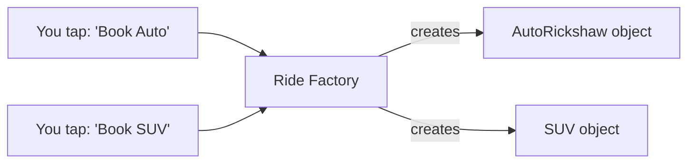
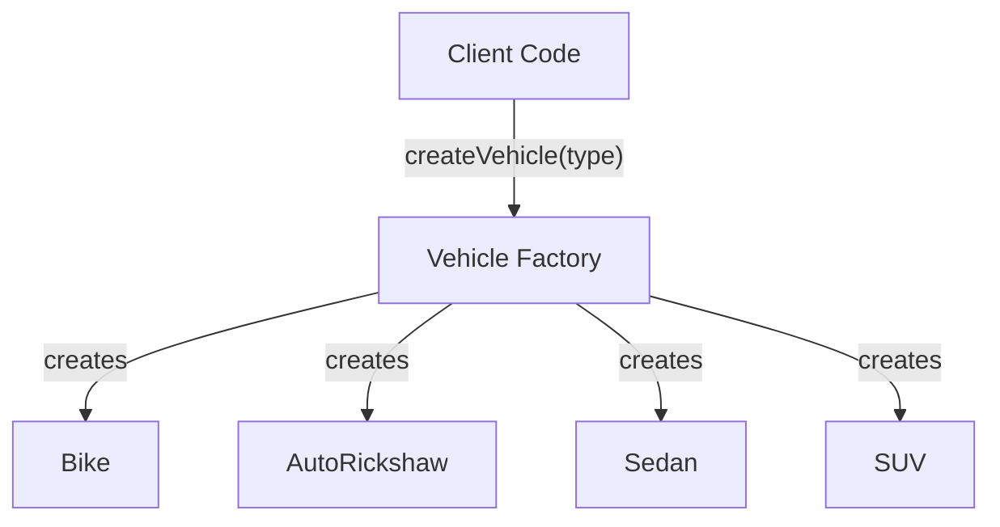
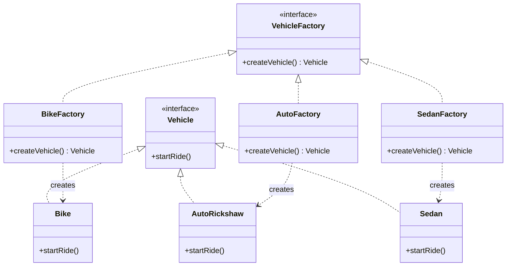
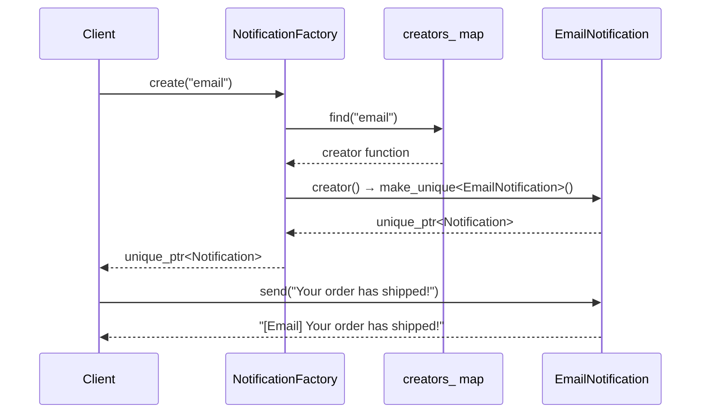
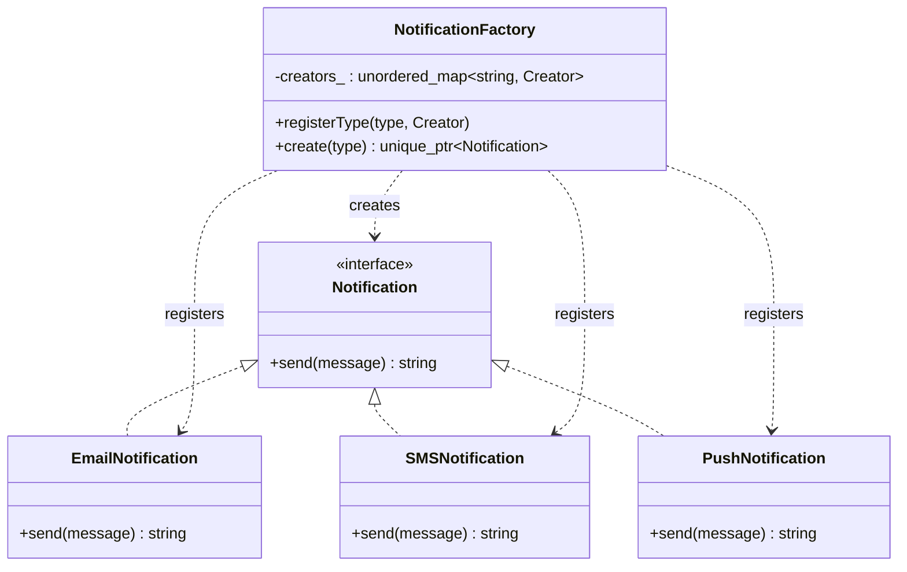

# Understanding the Factory Pattern in Modern C++ — Stop Writing `new` Everywhere, Let Someone Else Decide

---

## 1. Introduction: Why Shouldn't Your Code Decide *Exactly* What to Create?

Imagine you're building a ride-hailing app — think Uber or Ola. A user opens the app and taps **"Book a Ride."** Behind the scenes, your code has to create the right kind of vehicle object: `Bike`, `AutoRickshaw`, `Sedan`, or `SUV`, depending on what the user picked.

The tempting first instinct is to sprinkle `if`/`else if` chains with `new` calls everywhere this decision needs to be made:

```cpp
if (rideType == "bike") {
    vehicle = new Bike();
} else if (rideType == "auto") {
    vehicle = new AutoRickshaw();
} else if (rideType == "sedan") {
    vehicle = new Sedan();
} else if (rideType == "suv") {
    vehicle = new SUV();
}
```

This looks harmless with 4 vehicle types. But now imagine:

- This exact `if`/`else` block is copy-pasted in 6 different places across your codebase (booking screen, fare estimator, driver-matching engine, admin dashboard...)
- Tomorrow, product management adds `"Auto Premium"` and `"Bike Pool"`
- Now you have to hunt down and update all 6 copies — and if you miss one, you've got a subtle, hard-to-find bug

This is exactly the problem the **Factory Pattern** was invented to solve: **how do you create objects without hard-coding *which exact class* to create, scattered across your codebase?**

You'll run into this problem constantly:

- A ride-hailing app choosing between Bike, Auto, Sedan, SUV
- A notification system choosing between Email, SMS, and Push Notification
- A document exporter choosing between PDF, Word, and Excel output
- A game choosing which enemy type to spawn based on the current level
- A UI toolkit rendering the right kind of button for Windows, macOS, or Linux

Let's build this up from the messy version to the clean, modern C++ solution — the way a mentor would walk you through it.

---

## 2. A Real-World Analogy: Booking a Ride on Uber/Ola

Think about what actually happens when you book a ride.

- **You** don't personally know (or care) which specific driver, which specific car model, or how the vehicle gets assigned to you.
- You just say: **"I want an Auto"** — a simple request, describing *what kind* of thing you want, not *how* to build it.
- The app's internal system takes that request and hands you back a working, ready-to-use vehicle object — a specific auto-rickshaw, fully "constructed" with a driver, a license plate, and a route.
- If tomorrow the app adds "Auto Premium" as a new option, **you don't change how you book a ride at all** — you just see a new button. The app's internal creation logic handles the new type; your booking flow doesn't need to know the details.



> The **person booking** never writes `new AutoRickshaw()` themselves. They just say *what kind* they want, and a dedicated "factory" handles the actual creation — including any setup, configuration, or complexity involved.

That's the entire Factory Pattern in one sentence: **delegate the "which exact class do I create?" decision to one dedicated place, so the rest of your code just asks for what it needs, by type — not by construction detail.**

---

## 3. The Problem, Without Factory

Let's look at the "obvious but bad" version — scattering object-creation `if`/`else` logic directly wherever it's needed.

```cpp
#include <iostream>
#include <string>

class Vehicle {
public:
    virtual void startRide() = 0;
    virtual ~Vehicle() = default;
};

class Bike : public Vehicle {
public:
    void startRide() override { std::cout << "Bike ride started\n"; }
};

class AutoRickshaw : public Vehicle {
public:
    void startRide() override { std::cout << "Auto ride started\n"; }
};

class Sedan : public Vehicle {
public:
    void startRide() override { std::cout << "Sedan ride started\n"; }
};

// This block gets copy-pasted EVERYWHERE a vehicle needs to be created
void bookRide(const std::string& rideType) {
    Vehicle* vehicle = nullptr;

    if (rideType == "bike") {
        vehicle = new Bike();
    } else if (rideType == "auto") {
        vehicle = new AutoRickshaw();
    } else if (rideType == "sedan") {
        vehicle = new Sedan();
    }

    if (vehicle) {
        vehicle->startRide();
        delete vehicle; // someone has to remember this too...
    }
}
```

At first, this seems fine — it compiles, it runs, the ride starts. The pain shows up later.

---

## 4. Why This Becomes a Problem

| Problem | What Actually Happens |
|---|---|
| **Tight coupling** | Every place that books a ride now directly depends on `Bike`, `AutoRickshaw`, and `Sedan` — three concrete classes it shouldn't need to know about in detail. |
| **Code duplication** | The exact same `if`/`else` chain gets copy-pasted into the booking screen, the fare estimator, the driver-matching engine — anywhere a vehicle needs to be created. |
| **Difficult extension** | Adding `"suv"` means finding and editing every single copy of that `if`/`else` chain — easy to miss one. |
| **Violates Open/Closed Principle** | Existing, tested, working code has to be reopened and modified every time a new vehicle type is added. |
| **Error-prone memory management** | Every call site has to remember to `delete vehicle` — miss it once, and you've got a leak. |
| **Hard to test** | Testing the booking flow means you're also implicitly testing the exact construction logic of every vehicle type, tangled together. |

> **⚠️ Warning**
> If you're doing a find-and-replace across multiple files just to add one new type of object, that's the clearest possible signal you need a Factory.

---

## 5. Introducing the Factory Pattern

**Definition:** Factory is a creational design pattern that provides an interface for creating objects, but lets a dedicated piece of code decide which exact class to instantiate — hiding that decision (and any complex construction logic) from the code that just wants to *use* the object.

**Intent:** Separate the "what to create" decision from the "how to use it" logic, so that adding a new type doesn't require touching every place objects are created.

**Core idea, in plain words:**

> "Don't build it yourself. Ask the factory for what you need, and let it hand you a ready-to-use object."

There are, in practice, a few closely related flavors of this idea — worth knowing the names of, since they come up in interviews:

| Flavor | What It Means |
|---|---|
| **Simple Factory** | One function/class with an `if`/`switch` that creates the right object — not officially a GoF pattern, but the most common starting point. |
| **Factory Method** | A virtual method that subclasses override to decide which concrete object to create — the creation decision is delegated to subclasses. |
| **Abstract Factory** | A factory of factories — creates entire *families* of related objects that are meant to work together (e.g., all UI widgets for one operating system's look-and-feel). |

We'll build up through all three, since together they form "the Factory Pattern" as most developers use the term.



---

## 6. The Structure of the Factory Pattern

| Role | Job |
|---|---|
| **Product** (interface) | Declares the common interface every created object must have (e.g., `Vehicle`). |
| **ConcreteProduct** | An actual, specific implementation (e.g., `Bike`, `AutoRickshaw`, `Sedan`). |
| **Creator / Factory** | Declares the creation method and (in Factory Method) may be overridden by subclasses to change what gets created. |
| **ConcreteCreator** | Implements the creation method to produce a specific `ConcreteProduct`. |
| **Client** | Asks the factory for a product, and only ever interacts with the `Product` interface — never with concrete classes directly. |



---

## 7. Step-by-Step: The Simplest Possible Implementation (Simple Factory)

Let's fix the messy version from Section 3 with the most basic form of Factory — pulling the `if`/`else` logic into exactly **one** place.

```cpp
#include <iostream>
#include <memory>
#include <string>

// 1. The Product interface — every vehicle must be able to startRide().
class Vehicle {
public:
    virtual void startRide() = 0;
    virtual ~Vehicle() = default;
};

// 2. ConcreteProducts — the actual vehicle types.
class Bike : public Vehicle {
public:
    void startRide() override { std::cout << "Bike ride started\n"; }
};

class AutoRickshaw : public Vehicle {
public:
    void startRide() override { std::cout << "Auto ride started\n"; }
};

class Sedan : public Vehicle {
public:
    void startRide() override { std::cout << "Sedan ride started\n"; }
};

// 3. The Factory — the ONE place that knows how to create each type.
class VehicleFactory {
public:
    static std::unique_ptr<Vehicle> createVehicle(const std::string& rideType) {
        if (rideType == "bike") {
            return std::make_unique<Bike>();
        } else if (rideType == "auto") {
            return std::make_unique<AutoRickshaw>();
        } else if (rideType == "sedan") {
            return std::make_unique<Sedan>();
        }
        return nullptr; // unknown type
    }
};

int main() {
    // The client never writes "new Bike()" or "new Sedan()" — it just asks.
    std::unique_ptr<Vehicle> ride1 = VehicleFactory::createVehicle("auto");
    std::unique_ptr<Vehicle> ride2 = VehicleFactory::createVehicle("sedan");

    if (ride1) ride1->startRide();
    if (ride2) ride2->startRide();

    return 0; // unique_ptr cleans up automatically — no delete needed
}
```

### Line-by-line, like a mentor would explain it

- `class Vehicle` — the **contract**. Anything the factory produces must be able to `startRide()`.
- `class Bike`, `class AutoRickshaw`, `class Sedan` — the real, concrete vehicle types. Notice they know nothing about the factory — they're just normal classes.
- `class VehicleFactory` — this is the **single source of truth** for "how do I turn a ride type string into an actual vehicle object?" Every other part of the codebase that needs a vehicle now calls this one function instead of repeating the `if`/`else` chain.
- `static std::unique_ptr<Vehicle> createVehicle(...)` — returning a `unique_ptr<Vehicle>` (the interface type, not `Bike` or `Sedan` specifically) means the client only ever knows "I have *a* vehicle," not which concrete type — exactly the decoupling we wanted.
- In `main()`, notice the client (the booking code) never types `new Bike()` — it says what it wants ("auto", "sedan"), and lets the factory handle the rest.

> **💡 Tip**
> This "Simple Factory" isn't officially one of the 23 classic GoF design patterns — it's more of a common idiom. But it's almost always the first, most practical step, and interviewers are usually happy to see you recognize the distinction between this and true Factory Method below.

---

## 8. Leveling Up: Factory Method (Letting Subclasses Decide)

Simple Factory centralizes creation into one function, but that function still has to know about *every* vehicle type via `if`/`else`. **Factory Method** goes a step further: instead of one function branching on a string, each ride type gets its **own factory class**, and they all share a common interface.

```cpp
#include <iostream>
#include <memory>
#include <string>

class Vehicle {
public:
    [[nodiscard]] virtual std::string startRide() const = 0;
    virtual ~Vehicle() = default;
};

class Bike final : public Vehicle {
public:
    [[nodiscard]] std::string startRide() const override { return "Bike ride started"; }
};

class AutoRickshaw final : public Vehicle {
public:
    [[nodiscard]] std::string startRide() const override { return "Auto ride started"; }
};

// The abstract Creator — declares the "factory method" as a pure virtual function.
class VehicleFactory {
public:
    // This is THE factory method: subclasses decide what gets created.
    [[nodiscard]] virtual std::unique_ptr<Vehicle> createVehicle() const = 0;

    // Notice: business logic can live HERE, reused by every concrete factory,
    // without knowing which vehicle type it's actually working with.
    void bookRide() const {
        std::unique_ptr<Vehicle> vehicle = createVehicle();
        std::cout << vehicle->startRide() << "\n";
    }

    virtual ~VehicleFactory() = default;
};

// Each ConcreteCreator overrides the factory method for its own product.
class BikeFactory final : public VehicleFactory {
public:
    [[nodiscard]] std::unique_ptr<Vehicle> createVehicle() const override {
        return std::make_unique<Bike>();
    }
};

class AutoFactory final : public VehicleFactory {
public:
    [[nodiscard]] std::unique_ptr<Vehicle> createVehicle() const override {
        return std::make_unique<AutoRickshaw>();
    }
};

int main() {
    std::unique_ptr<VehicleFactory> factory = std::make_unique<AutoFactory>();
    factory->bookRide(); // "Auto ride started" — bookRide() never mentions AutoRickshaw by name

    factory = std::make_unique<BikeFactory>();
    factory->bookRide(); // "Bike ride started"

    return 0;
}
```

### Why this is a meaningful step up

- **`bookRide()` never changes**, no matter how many new vehicle types you add — it's written once, against the `Vehicle` interface, and works for every current and future concrete factory.
- **Adding a new vehicle type means adding a new class** (`SedanFactory`), not editing an existing `if`/`else` chain — this is the Open/Closed Principle in direct action.
- **The factory method (`createVehicle()`) is the *only* thing each subclass needs to implement** — all the surrounding logic (`bookRide()`) is shared, reusable, and doesn't get duplicated per vehicle type.

> **🎯 Interview Question**
> *"What's the actual difference between Simple Factory and Factory Method?"*
> **Answer:** Simple Factory is one function/class with conditional logic (`if`/`switch`) choosing which concrete class to create — it's a helper, not a formal pattern with polymorphism. Factory Method uses inheritance: an abstract creator declares a virtual creation method, and each concrete subclass overrides it to produce its own specific product — new types are added via new subclasses, not new `if` branches.

---

## 9. Modern C++ Refinements

Let's tighten the Factory Method example with modern C++ idioms and explain why each choice matters.

```cpp
#include <functional>
#include <memory>
#include <string>
#include <unordered_map>

class Vehicle {
public:
    [[nodiscard]] virtual std::string startRide() const = 0;
    virtual ~Vehicle() = default;
};

// A registry-based factory: no giant if/else, no new subclass per type needed
// for simple cases — just register a "creator function" per type name.
class VehicleRegistry {
public:
    using Creator = std::function<std::unique_ptr<Vehicle>()>;

    void registerVehicle(const std::string& type, Creator creator) {
        creators_[type] = std::move(creator);
    }

    [[nodiscard]] std::unique_ptr<Vehicle> create(const std::string& type) const {
        auto it = creators_.find(type);
        if (it == creators_.end()) {
            return nullptr; // or throw, depending on how strict you want to be
        }
        return it->second(); // call the stored creator function
    }

private:
    std::unordered_map<std::string, Creator> creators_;
};
```

### Why every choice here matters

- **`std::function<std::unique_ptr<Vehicle>()>` as the "Creator" type** — this is a modern, lightweight alternative to a full `VehicleFactory` class hierarchy for simple cases. Any callable (a lambda, a free function, a `std::bind` expression) that returns a `unique_ptr<Vehicle>` can be registered.
- **`std::unordered_map<std::string, Creator>`** — this turns "which type do I create?" into an O(1) average-case lookup instead of a chain of `if`/`else` comparisons — genuinely faster *and* easier to extend.
- **`registerVehicle()`** — new vehicle types can be added by calling this once (often at program startup), without touching the `VehicleRegistry` class itself at all — true Open/Closed compliance, even more flexible than subclassing.
- **`std::unique_ptr<Vehicle>` return type** — same reasoning as before: automatic cleanup, single clear owner, no manual `delete`.

```cpp
// Usage:
int main() {
    VehicleRegistry registry;
    registry.registerVehicle("bike", []() { return std::make_unique<Bike>(); });
    registry.registerVehicle("auto", []() { return std::make_unique<AutoRickshaw>(); });

    auto vehicle = registry.create("auto");
    if (vehicle) {
        std::cout << vehicle->startRide() << "\n";
    }
}
```

> **💡 Tip**
> This registry-based approach is extremely common in real production systems — plugin architectures, game engines registering enemy/entity types, and serialization libraries registering type names all use this exact idea: a map from a string (or type ID) to a "how do I create this?" function.

---

## 10. Complete, Production-Ready Example: A Notification Factory

Let's apply everything to a second, equally relatable scenario: a notification system that needs to send Email, SMS, or Push notifications depending on user preference — without the sending code ever hard-coding which concrete class it's using.

```cpp
#include <iostream>
#include <memory>
#include <string>
#include <functional>
#include <unordered_map>
#include <stdexcept>

// ---------- Product ----------
class Notification {
public:
    [[nodiscard]] virtual std::string send(const std::string& message) const = 0;
    virtual ~Notification() = default;
};

// ---------- ConcreteProducts ----------
class EmailNotification final : public Notification {
public:
    [[nodiscard]] std::string send(const std::string& message) const override {
        return "[Email] " + message;
    }
};

class SMSNotification final : public Notification {
public:
    [[nodiscard]] std::string send(const std::string& message) const override {
        return "[SMS] " + message;
    }
};

class PushNotification final : public Notification {
public:
    [[nodiscard]] std::string send(const std::string& message) const override {
        return "[Push] " + message;
    }
};

// ---------- Factory ----------
class NotificationFactory {
public:
    using Creator = std::function<std::unique_ptr<Notification>()>;

    NotificationFactory() {
        // Registered once, here — the "one place that knows about all types."
        registerType("email", [] { return std::make_unique<EmailNotification>(); });
        registerType("sms",   [] { return std::make_unique<SMSNotification>(); });
        registerType("push",  [] { return std::make_unique<PushNotification>(); });
    }

    void registerType(const std::string& type, Creator creator) {
        creators_[type] = std::move(creator);
    }

    [[nodiscard]] std::unique_ptr<Notification> create(const std::string& type) const {
        auto it = creators_.find(type);
        if (it == creators_.end()) {
            throw std::invalid_argument("Unknown notification type: " + type);
        }
        return it->second();
    }

private:
    std::unordered_map<std::string, Creator> creators_;
};

// ---------- Client ----------
void notifyUser(const NotificationFactory& factory,
                 const std::string& preferredChannel,
                 const std::string& message) {
    std::unique_ptr<Notification> notification = factory.create(preferredChannel);
    std::cout << notification->send(message) << "\n";
}

int main() {
    NotificationFactory factory;

    notifyUser(factory, "email", "Your order has shipped!");
    notifyUser(factory, "sms",   "Your OTP is 4821");
    notifyUser(factory, "push",  "You have a new message");

    try {
        notifyUser(factory, "carrier_pigeon", "This won't work");
    } catch (const std::invalid_argument& e) {
        std::cout << "Error: " << e.what() << "\n";
    }

    return 0;
}
```

---

## 11. Execution Flow: What Actually Happens, Step by Step

1. **Registration** — when `NotificationFactory` is constructed, it registers a lambda "creator" for each known type (`"email"`, `"sms"`, `"push"`) into an internal map.
2. **Client requests a type** — `notifyUser()` calls `factory.create("email")`, passing only a string — no knowledge of `EmailNotification` required.
3. **Lookup** — the factory looks up `"email"` in its map and finds the matching creator function.
4. **Creation** — the creator function runs (`std::make_unique<EmailNotification>()`), producing a real object wrapped in a `unique_ptr`.
5. **Return as interface type** — the factory hands back a `unique_ptr<Notification>`, not `unique_ptr<EmailNotification>` — the client only ever sees the abstract interface.
6. **Use** — the client calls `send()` on it, completely unaware of which concrete class is actually running underneath.
7. **Cleanup** — when the `unique_ptr` goes out of scope at the end of `notifyUser()`, the notification object is automatically destroyed — no manual `delete`.
8. **Unknown type handling** — if the requested type isn't registered, the factory throws a clear, specific exception instead of silently returning `nullptr` and causing a crash somewhere downstream.



---

## 12. Memory Management

- **The factory creates, the client owns** — `create()` returns a `unique_ptr<Notification>`, transferring full, exclusive ownership to whoever called it. The factory doesn't keep the object alive or track it afterward.
- **`std::unique_ptr` is the right default** — there's no need for shared ownership here; each created object has exactly one owner at a time, matching real-world "you booked one ride, you own that ride's vehicle object for its lifetime."
- **No leaks, no manual `delete`** — because ownership is expressed through `unique_ptr` from the moment of creation, destruction happens automatically and deterministically when the pointer goes out of scope.
- **If a factory *does* need to cache/reuse objects** (e.g., an expensive-to-construct object shared across multiple requests), that's a sign you might want the factory to return `std::shared_ptr` instead — but only when genuine sharing is required, since it adds reference-counting overhead you don't need otherwise.

> **⚠️ Warning**
> Don't have a factory return a raw pointer (`Vehicle*`) "for simplicity." It immediately raises the question "who deletes this, and when?" — a question `unique_ptr` answers for you, automatically, at compile time.

---

## 13. Thread Safety

- **Creating objects concurrently is usually safe by default** — if `create()` doesn't mutate any shared state (like our `creators_` map, once fully registered), multiple threads can safely call `create()` at the same time, since each call only *reads* the map and constructs a brand-new, independent object.
- **Registration is the risky part** — if `registerType()` can be called concurrently with `create()` (e.g., a plugin system registering new notification types while the app is already running), you need a `std::mutex` protecting the shared `creators_` map, since one thread modifying a `std::unordered_map` while another reads it is undefined behavior.

```cpp
class ThreadSafeNotificationFactory {
public:
    void registerType(const std::string& type, Creator creator) {
        std::lock_guard<std::mutex> lock(mutex_);
        creators_[type] = std::move(creator);
    }

    [[nodiscard]] std::unique_ptr<Notification> create(const std::string& type) const {
        Creator creatorCopy;
        {
            std::lock_guard<std::mutex> lock(mutex_);
            auto it = creators_.find(type);
            if (it == creators_.end()) {
                throw std::invalid_argument("Unknown notification type: " + type);
            }
            creatorCopy = it->second; // copy the function while locked
        }
        return creatorCopy(); // call it OUTSIDE the lock
    }

private:
    std::unordered_map<std::string, Creator> creators_;
    mutable std::mutex mutex_;
};
```

> **⚠️ Warning**
> Just like with Observer, avoid calling the actual creator function while still holding the lock — copy what you need under the lock, release it, then do the (potentially slower, user-defined) work outside. This keeps the lock held for the shortest possible time and avoids surprises if a creator function itself tries to touch the factory.

---

## 14. Advantages

- ✅ **Decoupling** — client code depends only on the abstract `Product` interface, never on concrete classes.
- ✅ **Single Responsibility** — object-creation logic lives in exactly one place, instead of scattered across the codebase.
- ✅ **Open/Closed Principle respected** — new types are added via new registrations or new subclasses, not by editing existing, tested code.
- ✅ **Centralized error handling** — invalid/unknown type requests are caught in one place, with one consistent behavior (exception, `nullptr`, default fallback — your choice, applied everywhere).
- ✅ **Easier testing** — you can register a fake/mock product type in tests without touching real production classes.

## 15. Disadvantages

- ❌ **Extra layer of indirection** — for a project with only 1-2 simple types that will basically never grow, a full factory can be over-engineering.
- ❌ **More classes/files** — Factory Method in particular can multiply your class count (one factory per product type), which adds navigation overhead in an IDE.
- ❌ **Can hide construction complexity too well** — if a factory does a lot of work internally (network calls, heavy computation), that cost can be non-obvious to whoever just sees `factory.create("email")`.
- ❌ **Registry-based factories need careful thread-safety handling** if registration happens dynamically at runtime rather than upfront.

---

## 16. When NOT to Use Factory

- When there's only **one** concrete type, and there's no realistic expectation of more being added — just construct it directly; a factory adds ceremony without benefit.
- When object construction is **trivial** (no branching, no configuration decisions) — `std::make_unique<Thing>()` directly at the call site is perfectly fine and more readable.
- When you actually need to configure a **complex object step-by-step** with many optional parameters — that's a job for the **Builder** pattern, not Factory.
- When creating a **family of related objects that must be used together** (e.g., a matching Button + Checkbox + Scrollbar for one OS theme) — that's specifically **Abstract Factory**, a related but distinct pattern worth naming precisely in an interview.

---

## 17. Real-World Uses

| Domain | Example |
|---|---|
| **Ride-hailing apps** | Choosing Bike/Auto/Sedan/SUV vehicle objects based on user selection |
| **GUI Toolkits** | Creating OS-appropriate buttons/menus/dialogs (Windows vs macOS vs Linux look-and-feel) |
| **Game Engines** | Spawning the correct enemy/item/projectile type based on level data |
| **Document Processing** | Choosing a PDF, Word, or Excel exporter based on requested file format |
| **Database Drivers** | Creating the correct connection object for MySQL, PostgreSQL, or SQLite based on a config string |
| **Logging Frameworks** | Creating a console logger, file logger, or remote logger based on configuration |
| **Payment Gateways** | Instantiating the right payment processor (Card, UPI, Wallet) based on user choice |
| **Serialization Libraries** | Reconstructing the correct object type from a type-tag stored in serialized data |

---

## 18. Common Interview Questions

> **🎯 Interview Question**
> *"Why use Factory instead of just calling `new` directly?"*
> **Answer:** Calling `new` directly scatters knowledge of concrete classes throughout the codebase, creating tight coupling and duplicated construction logic. Factory centralizes that decision, so adding or changing types touches one place instead of many, and client code depends only on an abstract interface.

> **🎯 Interview Question**
> *"What's the difference between Factory Method and Abstract Factory?"*
> **Answer:** Factory Method creates *one* product via a single overridable creation method, typically varying by subclass. Abstract Factory creates entire *families* of related products (multiple factory methods bundled into one interface) that are meant to be used together consistently — e.g., an entire UI theme's worth of matching widgets.

> **🎯 Interview Question**
> *"How is Factory different from Builder?"*
> **Answer:** Factory answers "which *type* of object should I create?" — usually in one call, for objects that don't need much step-by-step configuration. Builder answers "how do I construct *one complex* object piece by piece?" — useful when an object has many optional parts or a multi-step assembly process, regardless of type.

> **🎯 Interview Question**
> *"Is Simple Factory considered a 'real' design pattern?"*
> **Answer:** Not officially one of the 23 Gang of Four patterns — it's often called an idiom or a "factory-like" helper. True Factory Method relies on polymorphism (subclasses overriding a virtual creation method); Simple Factory typically relies on conditional branching in one function instead.

> **🎯 Interview Question**
> *"How would you avoid a long `if`/`else` chain in a factory as types grow?"*
> **Answer:** Use a registry — a `std::unordered_map` from a type key (string, enum, or type ID) to a creator function (`std::function`). New types are added by registering a new entry rather than editing existing branching logic, which also makes runtime/plugin-based registration possible.

> **🎯 Interview Question**
> *"Can a factory return `nullptr` for unrecognized types, or should it throw?"*
> **Answer:** Either can be valid depending on how the caller is expected to handle failure — returning `nullptr` requires every caller to remember to check it (easy to forget), while throwing forces the error to be handled (or crash loudly) and is often safer for genuinely invalid input. Pick one convention and apply it consistently across your factories.

---

## 19. Common Mistakes

1. **Returning raw pointers instead of `unique_ptr`/`shared_ptr`**, pushing ownership/cleanup responsibility onto the caller and risking leaks.
2. **Letting the factory's `if`/`else` chain grow unbounded** instead of switching to a registry once the type count grows past a handful.
3. **Forgetting a virtual destructor** on the `Product` base class — deleting a derived object through a base pointer without one is undefined behavior.
4. **Mixing Factory Method with Simple Factory inconsistently** within the same codebase, confusing anyone trying to extend it later.
5. **Registering/modifying a shared factory registry from multiple threads without synchronization.**
6. **Using Factory when Builder was actually needed** — forcing a single `create()` call to accept a huge list of optional parameters instead of using a proper step-by-step builder.

---

## 20. Comparison Table

| Pattern | Purpose | Creates | Typical Use |
|---|---|---|---|
| **Simple Factory** | Centralize creation logic in one place | One object, chosen via conditional logic | Small/medium apps, a handful of related types |
| **Factory Method** | Let subclasses decide what to create | One object, chosen via polymorphism | Frameworks where subclasses customize behavior |
| **Abstract Factory** | Create families of related objects | Multiple related objects, consistently themed | Cross-platform UI toolkits, themed object families |
| **Builder** | Construct one complex object step-by-step | One object, built incrementally | Objects with many optional parts/configuration steps |
| **Prototype** | Create new objects by cloning an existing one | One object, copied from a template instance | Expensive-to-construct objects, runtime-defined templates |

---

## 21. Best Practices

- Always return the **abstract Product interface type** (`unique_ptr<Vehicle>`, not `unique_ptr<Bike>`) from a factory — that's what actually decouples the client.
- Prefer a **registry (`std::unordered_map` + `std::function`)** over a long `if`/`else`/`switch` chain once you have more than a handful of types.
- Give every polymorphic base class a **virtual destructor** — non-negotiable when factories return objects through base-class pointers.
- Decide and document a clear convention for **unknown/invalid type requests** (exception vs `nullptr`) and stick to it across your codebase.
- Keep factories **focused on creation only** — resist the urge to have a factory also manage business logic unrelated to constructing the object.
- If registration can happen dynamically at runtime (plugin-style), **protect the registry with a mutex** and copy what you need before releasing the lock.

---

## 22. Complete UML Diagram



---

## 23. Expected Console Output

```
[Email] Your order has shipped!
[SMS] Your OTP is 4821
[Push] You have a new message
Error: Unknown notification type: carrier_pigeon
```

---

## 24. Complexity Analysis

| Operation | Simple Factory (`if`/`else`) | Registry-Based Factory |
|---|---|---|
| **Registration** | N/A (types hard-coded into the function) | O(1) average — inserting into `unordered_map` |
| **Creation lookup** | O(n) in the worst case — chain of comparisons | O(1) average — hash map lookup |
| **Adding a new type** | Requires editing existing function | Requires one new `registerType()` call, no edits to existing code |
| **Memory** | O(1) — no extra storage beyond the branching code itself | O(k) — one map entry per registered type, k = number of types |

---

## 25. FAQ

**Q: Is Factory Method the same as just using a virtual function?**
Factory Method *is* a specific, disciplined application of a virtual function — one whose entire job is to decide which concrete `Product` to instantiate. Not every virtual function is a "factory method"; only ones whose purpose is object creation count.

**Q: When should I choose Abstract Factory over Factory Method?**
When you need to guarantee that a *set* of related objects are created consistently together — e.g., you never want a Windows-style button paired with a macOS-style scrollbar by accident. Abstract Factory bundles multiple factory methods into one interface to enforce that consistency.

**Q: Can a Factory return `shared_ptr` instead of `unique_ptr`?**
Yes, if the created object genuinely needs shared ownership afterward (e.g., it will be stored in multiple places, or cached and reused). Default to `unique_ptr` unless you have a specific reason for shared ownership — it's cheaper and expresses intent more precisely.

**Q: Isn't a registry-based factory basically the same as a giant `switch` statement in disguise?**
Not quite — a `switch` statement requires editing existing code for every new type, and all cases must be known at compile time. A registry lets new types be added by *calling a function* at runtime (even from a separate plugin module), without modifying the factory's own source code at all.

**Q: Does the Factory Pattern require inheritance?**
Simple Factory and registry-based factories don't require inheritance among the factories themselves (though the Products they create are still typically polymorphic). Classic Factory Method specifically relies on inheritance/polymorphism for the *creators* — that's its defining characteristic.

**Q: How does Factory Pattern relate to Dependency Injection?**
They solve related but different problems — Factory decides *which concrete type* to construct based on some input (a string, an enum, config). Dependency Injection is about *who provides* an already-constructed dependency to an object (often via constructor parameters), frequently using a factory internally to actually build what gets injected.

**Q: Should every `new` in my codebase go through a factory?**
No — that would be over-engineering. Reach for Factory when there's real variability in *what* gets created based on runtime information, or when construction logic is complex/duplicated enough to be worth centralizing. Plain, simple objects can just be constructed directly.

**Q: What happens if two threads call `create()` on the same factory at the same time?**
If `create()` only reads shared state (like an already-fully-registered map) and constructs a brand-new, independent object each time, this is safe without extra locking. It only becomes unsafe if creation also mutates shared state, or if registration can happen concurrently with creation.

---

## 26. Key Takeaways

- Factory Pattern **centralizes the "which class do I create?" decision** in one place, instead of scattering it across the codebase.
- **Simple Factory** uses conditional branching in one function; **Factory Method** uses subclass polymorphism; **Abstract Factory** creates whole families of related objects.
- A **registry (`unordered_map` + `std::function`)** scales better than a growing `if`/`else` chain, and enables runtime/plugin-style registration.
- Always return the **abstract interface type**, never a concrete class, to keep client code properly decoupled.
- `std::unique_ptr` is almost always the right ownership model for factory output — automatic cleanup, single clear owner.
- It's the same idea behind booking a ride on Uber/Ola: you ask for *what* you want, and a dedicated system decides *how* to build it.

---

## 27. Conclusion

The Factory Pattern is really just "ask, don't build" — the same principle that lets you tap "Book Auto" on a ride-hailing app without knowing (or caring) which exact driver, vehicle, or route gets assigned. Once you see this pattern, you'll notice it everywhere: in GUI toolkits picking the right widget style, in game engines spawning enemies, in notification systems choosing a delivery channel.

The best way to really internalize it is to extend the notification example yourself — add a `WhatsAppNotification` type and register it, without touching a single line of the existing `EmailNotification` or `SMSNotification` code. That "I didn't have to touch working code" feeling is the entire point of the pattern.

*Have you built a Factory in a real project — maybe a plugin system, or a driver/type registry? What made you reach for it? Drop it in the comments — I read every one.*

---
---