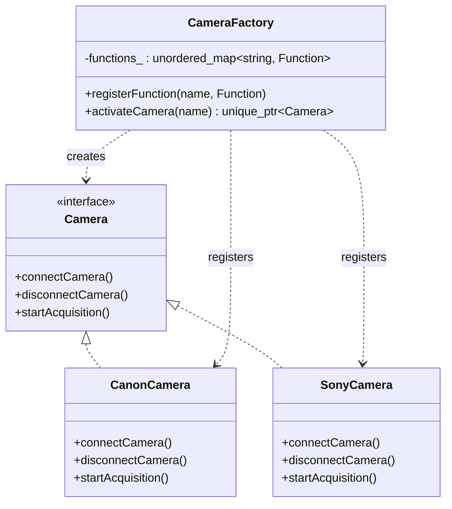
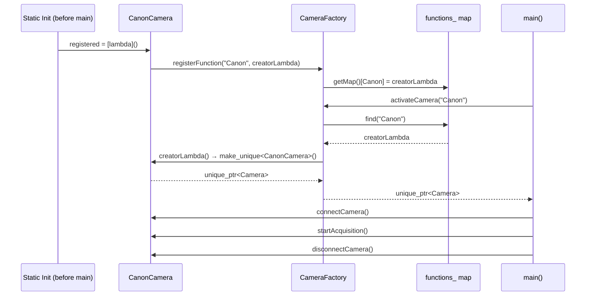
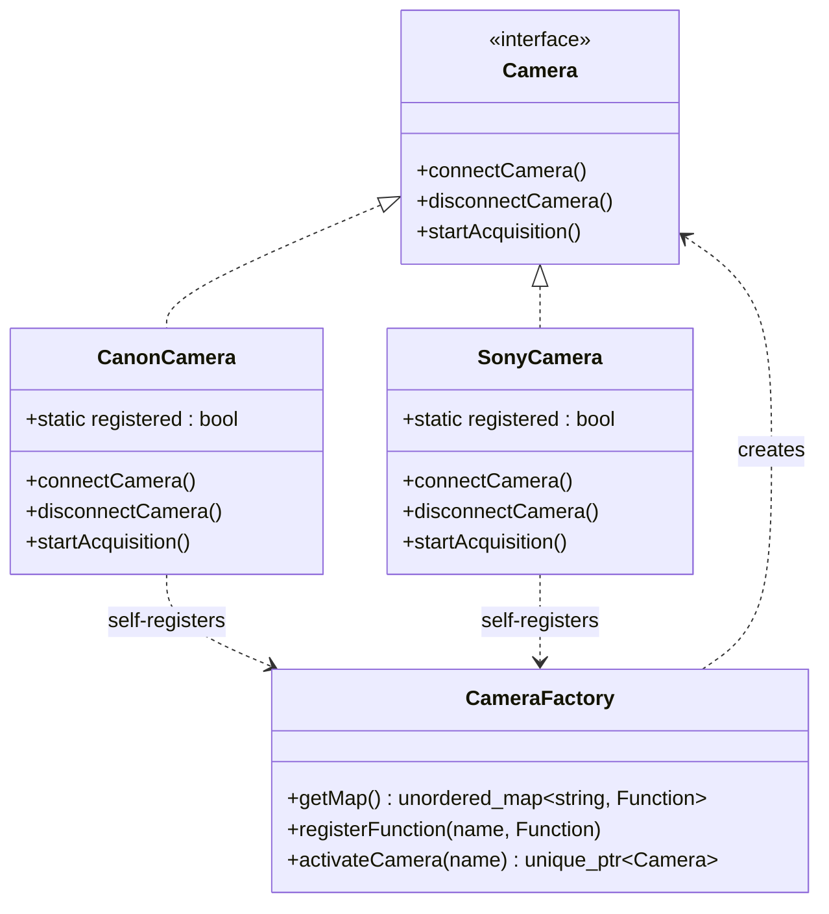

# Understanding the Factory Pattern in Modern C++ — Build a Self-Registering Camera Factory Like a Pro

---

## 1. Introduction: Why Shouldn't Your Code Decide *Exactly* Which Camera to Create?

Imagine you're building imaging/acquisition software that has to support cameras from multiple vendors — Canon, Sony, and eventually FLIR, Basler, whoever comes next. Somewhere in your code, you need to turn a simple request like `"Canon"` into an actual, working `CanonCamera` object.

The tempting first instinct is to write an `if`/`else` chain wherever a camera needs to be created:

```cpp
if (brand == "Canon") {
    camera = new CanonCamera();
} else if (brand == "Sony") {
    camera = new SonyCamera();
}
```

This looks fine with 2 brands. But now imagine:

- This exact block is copy-pasted in the UI's device picker, the calibration module, the acquisition engine, and a diagnostics tool
- Next quarter, you add support for a FLIR thermal camera
- You now have to hunt down and edit 4 different copies of that `if`/`else` chain — miss one, and that part of the app simply can't see the new camera

This is exactly the problem the **Factory Pattern** solves: **how do you create the right object, by name, without hard-coding "which exact class" everywhere that object is needed?**

By the end of this article, we'll build up to a real, production-style **self-registering Camera Factory** — the exact kind of design used in imaging systems, plugin architectures, and driver frameworks — and understand every single line of *why* it's written the way it is.

---

## 2. A Real-World Analogy Before We Touch Code: Ordering Food at a Restaurant

Before diving into camera drivers, let's ground the *idea* itself with something everyone already understands intuitively.

- **You (the customer)** don't walk into the kitchen and cook your own food. You just say **"One Pizza, please."**
- **The kitchen** is the one place that knows how to turn "Pizza" into an actual, finished pizza — recipe, ingredients, cooking steps, all hidden from you.
- If the restaurant adds Sushi to the menu next month, **you don't change how you order** — you just see a new item. The kitchen's internal recipe list grows; your ordering process doesn't.


> The customer never personally cooks. They ask for *what* they want, by name, and one dedicated place — the kitchen — handles *how*.

Now swap "customer" for "your application code," "kitchen" for "Camera Factory," and "Pizza" for "Canon" — and you have exactly the design we're about to build.


---

## 3. The Problem, Without a Factory

Here's the "obvious but bad" version most people write first — camera creation logic scattered directly into wherever it's needed.

```cpp
#include <iostream>
#include <string>

class Camera {
public:
    virtual void connectCamera() = 0;
    virtual void disconnectCamera() = 0;
    virtual void startAcquisition() = 0;
    virtual ~Camera() = default;
};

class CanonCamera : public Camera {
public:
    void connectCamera() override { std::cout << "Canon Camera connected\n"; }
    void disconnectCamera() override { std::cout << "Canon Camera disconnected\n"; }
    void startAcquisition() override { std::cout << "Canon Camera acquisition started\n"; }
};

class SonyCamera : public Camera {
public:
    void connectCamera() override { std::cout << "Sony Camera connected\n"; }
    void disconnectCamera() override { std::cout << "Sony Camera disconnected\n"; }
    void startAcquisition() override { std::cout << "Sony Camera acquisition started\n"; }
};

// This exact block gets copy-pasted everywhere a camera needs to be created:
// the UI device picker, the calibration module, the acquisition engine...
Camera* createCamera(const std::string& brand) {
    if (brand == "Canon") {
        return new CanonCamera();
    } else if (brand == "Sony") {
        return new SonyCamera();
    }
    return nullptr;
}

int main() {
    Camera* cam = createCamera("Canon");
    if (cam) {
        cam->connectCamera();
        cam->startAcquisition();
        cam->disconnectCamera();
        delete cam; // someone has to remember this, everywhere this pattern repeats
    }
    return 0;
}
```

This compiles and runs fine. The pain shows up the moment a second module also needs to create cameras, or a new brand gets added.

---

## 4. Why This Becomes a Problem

| Problem | What Actually Happens |
|---|---|
| **Tight coupling** | Every module that creates a camera now directly depends on `CanonCamera` and `SonyCamera` — classes it shouldn't need to know about in detail. |
| **Code duplication** | The same `if`/`else` chain gets copy-pasted into every module that needs to create a camera. |
| **Difficult extension** | Adding `FlirCamera` means finding and editing every copy of that `if`/`else` chain — miss one, and that module silently can't create the new camera. |
| **Violates Open/Closed Principle** | Existing, tested code has to be reopened and modified every time a new camera brand is supported. |
| **Error-prone memory management** | Every call site must remember `delete cam` — miss it once, and you leak a camera handle. |
| **Poor separation of concerns** | Code that just wants to *use* a camera (acquisition logic) is tangled up with code that knows *how to construct* every camera brand. |

> **⚠️ Warning**
> If supporting a new camera brand means editing four different files across your codebase, that's the clearest possible signal you need a Factory.

---

## 5. Introducing the Factory Pattern

**Definition:** Factory is a creational design pattern that provides a way to create objects without exposing exactly which concrete class gets instantiated — one dedicated place handles that decision, and the rest of the code just asks by name.

**Intent:** Separate "which camera class do I construct?" from "how do I use a camera," so that adding a new brand doesn't require touching every place cameras get created.

**Core idea, in plain words:**

> "Don't construct it yourself. Ask the factory for it by name, and let it hand you a ready-to-use object."

There are a few closely related flavors worth knowing by name, since interviewers love asking about the differences:

| Flavor | What It Means |
|---|---|
| **Simple Factory** | One function/class with an `if`/`switch` deciding which concrete object to create. |
| **Factory Method** | A virtual method overridden by subclasses to decide what gets created — decision delegated via inheritance. |
| **Self-Registering Factory** | A registry (map of name → creator function) where each concrete class registers *itself* automatically, before `main()` even runs. This is exactly what your Camera example uses, and it's the version most real production systems (driver frameworks, plugin systems) actually reach for. |

We'll build up through all three so the final self-registering version makes complete sense.

---

## 6. The Structure of the Factory Pattern

| Role | Camera Example |
|---|---|
| **Product** (interface) | `Camera` — declares `connectCamera()`, `disconnectCamera()`, `startAcquisition()`. |
| **ConcreteProduct** | `CanonCamera`, `SonyCamera` — actual, working implementations. |
| **Creator / Factory** | `CameraFactory` — knows how to turn a name into a `Camera`. |
| **Registration mechanism** | Each `ConcreteProduct` registers a "how to build me" function into the factory's internal map. |
| **Client** | Application code that calls `CameraFactory::activateCamera("Canon")` — never touches `CanonCamera` directly. |



---

## 7. Step-by-Step: The Simplest Fix (Simple Factory)

Let's pull the `if`/`else` chain from Section 3 into exactly **one** place.

```cpp
#include <iostream>
#include <memory>
#include <string>

class Camera {
public:
    virtual void connectCamera() = 0;
    virtual void disconnectCamera() = 0;
    virtual void startAcquisition() = 0;
    virtual ~Camera() = default;
};

class CanonCamera : public Camera {
public:
    void connectCamera() override { std::cout << "Canon Camera connected\n"; }
    void disconnectCamera() override { std::cout << "Canon Camera disconnected\n"; }
    void startAcquisition() override { std::cout << "Canon Camera acquisition started\n"; }
};

class SonyCamera : public Camera {
public:
    void connectCamera() override { std::cout << "Sony Camera connected\n"; }
    void disconnectCamera() override { std::cout << "Sony Camera disconnected\n"; }
    void startAcquisition() override { std::cout << "Sony Camera acquisition started\n"; }
};

// The ONE place that knows how to build each camera brand.
class CameraFactory {
public:
    static std::unique_ptr<Camera> create(const std::string& brand) {
        if (brand == "Canon") {
            return std::make_unique<CanonCamera>();
        } else if (brand == "Sony") {
            return std::make_unique<SonyCamera>();
        }
        return nullptr; // unsupported brand
    }
};

int main() {
    std::unique_ptr<Camera> cam = CameraFactory::create("Canon");
    if (cam) {
        cam->connectCamera();
        cam->startAcquisition();
        cam->disconnectCamera();
    }
    return 0; // unique_ptr cleans up automatically
}
```

### Why this is already better

- `CameraFactory::create()` is the **single source of truth** for turning a brand name into a real object — every module that needs a camera now calls this instead of repeating the `if`/`else` chain.
- `std::unique_ptr<Camera>` means the caller owns exactly one camera, and cleanup happens automatically — no `delete` anywhere.

But there's still one problem left: **`CameraFactory` itself has to know about every concrete camera class** (`CanonCamera`, `SonyCamera`, ...). Adding `FlirCamera` still means editing `CameraFactory`'s source code. Let's fix that next — this is exactly what your example does.

---

## 8. The Production-Grade Solution: A Self-Registering Camera Factory

Here's the real design your code implements — a **registry-based, self-registering factory**. Instead of the factory knowing about every camera class, **each camera class registers itself** with the factory, automatically, before `main()` even runs.

```cpp
#include <iostream>
#include <functional>
#include <unordered_map>
#include <memory>
#include <string>

// ---------- Product ----------
class Camera
{
public:
    virtual void connectCamera() = 0;
    virtual void disconnectCamera() = 0;
    virtual void startAcquisition() = 0;
    virtual ~Camera() = default;   // required: we delete through base pointers
};

// ---------- Factory / Registry ----------
class CameraFactory
{
public:
    using Function = std::function<std::unique_ptr<Camera>()>;

    static std::unordered_map<std::string, Function>& getMap()
    {
        static std::unordered_map<std::string, Function> functions; // Meyers Singleton
        return functions;
    }

    static void registerFunction(const std::string& name, Function function)
    {
        getMap()[name] = std::move(function);
    }

    static std::unique_ptr<Camera> activateCamera(const std::string& name)
    {
        auto it = getMap().find(name);
        if (it != getMap().end())
        {
            return it->second();
        }
        return nullptr; // brand not registered
    }
};

// ---------- ConcreteProduct: Canon ----------
class CanonCamera : public Camera
{
public:
    static bool registered;

    void connectCamera() override
    {
        std::cout << "Canon Camera connected ...\n";
    }

    void disconnectCamera() override
    {
        std::cout << "Canon Camera disconnected ...\n";
    }

    void startAcquisition() override
    {
        std::cout << "Canon Camera acquisition started ...\n";
    }
};

bool CanonCamera::registered = []() {
    CameraFactory::registerFunction("Canon", []() {
        return std::make_unique<CanonCamera>();
    });
    return true;
}();

// ---------- ConcreteProduct: Sony ----------
class SonyCamera : public Camera
{
public:
    static bool registered;

    void connectCamera() override
    {
        std::cout << "Sony Camera connected ...\n";
    }

    void disconnectCamera() override
    {
        std::cout << "Sony Camera disconnected ...\n";
    }

    void startAcquisition() override
    {
        std::cout << "Sony Camera acquisition started ...\n";
    }
};

bool SonyCamera::registered = []() {
    CameraFactory::registerFunction("Sony", []() {
        return std::make_unique<SonyCamera>();
    });
    return true;
}();

// ---------- Client ----------
int main()
{
    auto camera = CameraFactory::activateCamera("Canon");
    if (camera)
    {
        camera->connectCamera();
        camera->startAcquisition();
        camera->disconnectCamera();
    }
    else
    {
        std::cout << "Requested camera brand not registered.\n";
    }

    return 0;
}
```

### Line-by-line, like a mentor would explain it

- **`using Function = std::function<std::unique_ptr<Camera>()>;`** — a "Function" here is anything callable with no arguments that returns a `unique_ptr<Camera>`. This is our "recipe" — a small, storable piece of "how to build one of these."
- **`static std::unordered_map<std::string, Function>& getMap()`** — this is a **Meyers Singleton** (the same pattern from our Singleton article!): a function-local `static` map, constructed exactly once, on first use, and thread-safely guaranteed by C++11's "magic statics." We return it by reference so every caller works with the *same* map.
- **Why `getMap()` instead of a plain static member variable?** — this sidesteps the **static initialization order fiasco**: if `functions` were a regular static member of `CameraFactory`, and `CanonCamera::registered` tried to use it *before* it was constructed (which can genuinely happen with statics across different `.cpp` files), you'd get undefined behavior. A function-local static is guaranteed to be initialized the *first time it's actually used* — not at some unpredictable point during program startup.
- **`registerFunction(name, function)`** — stores a recipe under a brand name. This is called automatically for every camera class, before `main()` runs.
- **`activateCamera(name)`** — looks up the recipe by name and calls it, producing a real, working camera object. If the name isn't found, it returns `nullptr` instead of crashing.
- **`static bool CanonCamera::registered = [](){ ... }();`** — this is the real trick. `registered` is a `static` class member, which means it must be initialized exactly once, *before* `main()` runs (as part of static/global initialization). We initialize it with an **immediately-invoked lambda** — the `()` at the very end calls the lambda right there, during initialization. Inside that lambda, we call `CameraFactory::registerFunction("Canon", ...)`. The lambda's return value (`true`) is just there to give `registered` a value — the *real* purpose of this line is the side effect of registering, not the boolean itself.
- **Result:** by the time `main()` starts, both `"Canon"` and `"Sony"` are already registered in the factory's map — **nobody had to manually call a setup function**, and `CameraFactory`'s source code never mentions `CanonCamera` or `SonyCamera` by name anywhere. That's true decoupling.

> **💡 Tip**
> This self-registration trick is exactly how many real driver frameworks and plugin systems work: each plugin `.cpp` file "announces itself" via a static initializer, and the core framework never needs to `#include` or know about any specific plugin.

---

## 9. Execution Flow: What Actually Happens, Step by Step

1. **Before `main()` runs** — static initialization happens. `CanonCamera::registered`'s initializer lambda runs, which calls `CameraFactory::registerFunction("Canon", ...)`. Same for `SonyCamera::registered` and `"Sony"`.
2. **First call to `registerFunction`** — internally calls `getMap()`, which constructs the function-local static `unordered_map` the very first time it's needed (Meyers Singleton in action).
3. **Both brands now sit in the map** — `"Canon"` → a lambda that builds a `CanonCamera`; `"Sony"` → a lambda that builds a `SonyCamera`.
4. **`main()` starts, calls `CameraFactory::activateCamera("Canon")`** — the factory looks up `"Canon"` in the map.
5. **Found it — calls the stored lambda** — `std::make_unique<CanonCamera>()` runs, producing a real object.
6. **Ownership returns to `main()`** as `std::unique_ptr<Camera>` — `main()` now owns this camera exclusively.
7. **`main()` uses the camera** through the abstract `Camera` interface — `connectCamera()`, `startAcquisition()`, `disconnectCamera()` — never once referring to `CanonCamera` directly.
8. **Cleanup** — when `camera` goes out of scope at the end of `main()`, its destructor runs automatically. No `delete` anywhere.



---

## 10. Memory Management

- **The factory creates, the caller owns** — `activateCamera()` returns `std::unique_ptr<Camera>`, transferring full, exclusive ownership to `main()` (or whichever module requested it). The factory keeps no reference to the object afterward.
- **Why `unique_ptr` and not `shared_ptr`?** — in almost every real acquisition system, one camera handle belongs to exactly one owner at a time (the module actively using it). There's no need for shared, reference-counted ownership here — `unique_ptr` expresses "I have exclusive control of this camera" precisely, with zero extra overhead.
- **No leaks, no manual `delete`, no dangling pointers** — cleanup happens automatically and deterministically when the `unique_ptr` goes out of scope, cascading through `~Camera()` correctly *because* `Camera` has a virtual destructor.
- **The `virtual ~Camera() = default;` line is not optional** — without it, `delete`-ing a `CanonCamera` through a `Camera*` (which is exactly what a `unique_ptr<Camera>` does internally) is undefined behavior: only the base part gets destroyed, and any resources `CanonCamera` itself owns would leak.

> **⚠️ Warning**
> This is one of the most common real-world C++ bugs in factory-style code: forgetting the virtual destructor on the `Product` interface. It compiles fine, runs fine in simple tests, and then leaks or corrupts memory the moment a derived class actually owns non-trivial resources (like a camera handle, a socket, or a hardware connection).

---

## 11. Thread Safety

- **Reading (`activateCamera`) is safe once the map is fully populated** — since self-registration happens during static initialization, *before* `main()` even starts, by the time any thread calls `activateCamera()`, the map is already complete and effectively read-only. Multiple threads calling `activateCamera()` concurrently is safe, because they're only reading the map and constructing independent, brand-new camera objects.
- **The risk is if registration can happen *after* `main()` starts** — e.g., a true plugin system that loads a shared library at runtime and registers a new camera brand while the app is already running and possibly calling `activateCamera()` from another thread. In that case, you'd need a `std::mutex` protecting `getMap()`.

```cpp
static std::unordered_map<std::string, Function>& getMap()
{
    static std::unordered_map<std::string, Function> functions;
    return functions;
}

static std::mutex& getMutex()
{
    static std::mutex m;
    return m;
}

static void registerFunction(const std::string& name, Function function)
{
    std::lock_guard<std::mutex> lock(getMutex());
    getMap()[name] = std::move(function);
}

static std::unique_ptr<Camera> activateCamera(const std::string& name)
{
    Function creator;
    {
        std::lock_guard<std::mutex> lock(getMutex());
        auto it = getMap().find(name);
        if (it == getMap().end()) return nullptr;
        creator = it->second; // copy the creator while locked
    }
    return creator(); // actually construct the camera OUTSIDE the lock
}
```

> **💡 Tip**
> For the common case — all camera types known at compile time and self-registered before `main()` — you don't need this extra locking at all. Only add it once you have genuine runtime/plugin-style registration happening concurrently with lookups.

---

## 12. Advantages

- ✅ **True decoupling** — `CameraFactory` never `#include`s or mentions `CanonCamera`/`SonyCamera` — new camera classes plug in without touching the factory's source at all.
- ✅ **Zero manual setup** — no "don't forget to call `registerAllCameras()` in `main()`" step to remember; registration happens automatically via static initialization.
- ✅ **Open/Closed Principle, fully respected** — adding `FlirCamera` support means writing one new `.cpp` file, with zero edits to existing, tested code.
- ✅ **Great for plugin/driver architectures** — a new camera vendor's SDK wrapper can live in its own translation unit (or even its own shared library) and register itself independently.
- ✅ **Centralized failure handling** — an unsupported brand is handled in exactly one place (`activateCamera` returning `nullptr`), not duplicated everywhere.

## 13. Disadvantages

- ❌ **"Magic" registration can be surprising** — a new developer reading `main()` won't see *where* `"Canon"` got registered; it happens silently via static initialization, which can be confusing without this kind of explanation.
- ❌ **Static initialization order across files is subtle** — while `getMap()`'s function-local static protects the map itself, if a registration lambda depended on some *other* global object, order-of-initialization bugs become possible.
- ❌ **Harder to unit test in isolation** — because registration is global and happens at program startup, it's harder to reset/mock the registry between individual test cases compared to explicit, constructor-injected factories.
- ❌ **Unused classes may get silently stripped by the linker** — in some build configurations (especially static libraries), if `CanonCamera`'s translation unit is never referenced elsewhere, the linker might discard it entirely, along with its registration — a real, known gotcha with this pattern that sometimes requires explicit "force link" tricks.

> **⚠️ Warning**
> That last point is a genuine production pitfall. If a self-registered class mysteriously "isn't found" by the factory despite the code looking correct, check whether the linker dropped that translation unit because nothing else in the binary directly references it.

---

## 14. When NOT to Use This Pattern

- When you only ever support **one** camera brand, with no real plan to add more — skip the factory machinery entirely and construct it directly.
- When you need **explicit, testable control** over exactly which implementations are available (e.g., injecting a `MockCamera` cleanly in unit tests) — an explicitly constructed factory (passed as a dependency) can be easier to control than a globally self-registering one.
- When your build system aggressively strips unreferenced translation units (some embedded/statically-linked builds) — self-registration can silently fail unless you add explicit reference/force-link steps.
- When you need to construct a **whole family of matching hardware components together** (camera + matching lens driver + matching lighting controller, all from one vendor) — that calls for **Abstract Factory**, not a single-product factory like this one.

---

## 15. Real-World Uses

| Domain | Example |
|---|---|
| **Imaging / machine vision systems** | Exactly this — registering camera/detector drivers by vendor name |
| **Plugin architectures** | Each plugin `.so`/`.dll` self-registers its capabilities on load |
| **Game Engines** | Registering component types, entity types by name/ID for level data-driven spawning |
| **Serialization Libraries** | Registering type names so serialized data can be reconstructed into the correct class |
| **Logging Frameworks** | Registering named log sinks (console, file, network) |
| **Database Drivers** | Registering connector implementations for MySQL, PostgreSQL, SQLite by name |
| **Codec Libraries** | Registering encoders/decoders by format name (H.264, JPEG, PNG) |

---

## 16. Common Interview Questions

> **🎯 Interview Question**
> *"What's the difference between Simple Factory and a self-registering factory?"*
> **Answer:** Simple Factory has the factory itself contain an `if`/`switch` that knows about every concrete class — the factory depends on the products. A self-registering factory inverts this: each product registers itself into the factory's map, so the factory never needs to know concrete class names at all — the dependency direction is reversed, giving true decoupling.

> **🎯 Interview Question**
> *"Why use a function-local static (`getMap()`) instead of a regular static member variable for the registry?"*
> **Answer:** To avoid the static initialization order fiasco. Initialization order of global/static objects across different translation units is unspecified in C++. A function-local static, by contrast, is guaranteed by the C++11 standard to be constructed the first time control reaches its declaration — which safely handles registration happening from many different `.cpp` files in any order.

> **🎯 Interview Question**
> *"How does the `static bool registered = [](){...}();` trick actually work?"*
> **Answer:** `registered` is a static class member, so it must be initialized before `main()` runs. We give it an immediately-invoked lambda as its initializer — the lambda runs once, during static initialization, calls `registerFunction()` as a side effect, and returns `true` just to give `registered` a value. The boolean itself isn't meaningful; the side effect is the whole point.

> **🎯 Interview Question**
> *"Why does `Camera` need a virtual destructor here?"*
> **Answer:** Because `activateCamera()` returns a `unique_ptr<Camera>` pointing at a `CanonCamera` or `SonyCamera` object. When that `unique_ptr` is destroyed, it calls `delete` through the base `Camera*`. Without a virtual destructor, only `Camera`'s (trivial) destructor would run — the derived class's destructor, and any resources it owns, would never be cleaned up. This is undefined behavior, not just a leak.

> **🎯 Interview Question**
> *"Is this pattern thread-safe?"*
> **Answer:** Reads (`activateCamera`) are safe once all registration has happened, because registration typically completes during static initialization before any thread starts running application code. If registration can happen dynamically at runtime (e.g., loading plugins after `main()` starts), the shared map needs explicit synchronization (a mutex).

---

## 17. Common Mistakes

1. **Forgetting the virtual destructor** on `Camera` — the single most common bug in exactly this kind of code.
2. **Not checking for `nullptr`** after `activateCamera()` — requesting an unregistered brand returns `nullptr`, and calling a method on it crashes.
3. **Using a plain static member map instead of a function-local static** — reintroduces the static initialization order fiasco this design is specifically meant to avoid.
4. **Forgetting that unreferenced translation units can be stripped by the linker**, silently "losing" a self-registered class in certain build configurations.
5. **Registering the same name twice** (e.g., two different modules both registering `"Canon"`) — `operator[]` silently overwrites the earlier registration with no warning.
6. **Modifying the registry from multiple threads without synchronization** in true dynamic-plugin scenarios.

---

## 18. Comparison Table

| Pattern | Who Knows About Concrete Classes? | Registration | Best For |
|---|---|---|---|
| **Simple Factory** | The factory itself (`if`/`switch`) | None — hard-coded | Small, fixed sets of types |
| **Factory Method** | Each concrete `Creator` subclass | Via inheritance/subclassing | Frameworks where behavior varies by subclass |
| **Self-Registering Factory** | Nobody centrally — products register themselves | Automatic, via static initialization | Plugin systems, driver frameworks, extensible SDKs |
| **Abstract Factory** | The factory itself, for a whole family | Hard-coded per family | Creating matching sets of related objects |

---

## 19. Best Practices

- Always give the `Product` interface (`Camera`) a **virtual destructor** — non-negotiable when factories return objects through base-class pointers.
- Use a **function-local `static`** for the registry map, never a plain static member — sidesteps initialization-order bugs entirely.
- **Check for `nullptr`** every time you call the factory's create method — an unregistered name is a normal, expected outcome, not an exceptional one, unless you decide to throw instead.
- Keep the registration lambda **small and side-effect-free** beyond the registration call itself — it runs during static initialization, before `main()`, where debugging is harder and ordering guarantees are limited.
- If you truly need runtime/plugin-style registration after `main()` has started, add a **mutex** around the registry and copy the creator function out before calling it.
- Document the **naming convention** for registered keys (`"Canon"`, `"Sony"`) somewhere central, since there's no compiler-enforced list of valid names — a typo like `"canon"` (wrong case) silently returns `nullptr`.

---

## 20. Complete UML Diagram



---

## 21. Expected Console Output

```
Canon Camera connected ...
Canon Camera acquisition started ...
Canon Camera disconnected ...
```

If you instead call `CameraFactory::activateCamera("Nikon")` (unregistered):

```
Requested camera brand not registered.
```

---

## 22. Complexity Analysis

| Operation | Cost |
|---|---|
| **Self-registration (per class, once at startup)** | O(1) — one map insertion per registered brand |
| **`activateCamera()` lookup** | O(1) average — hash map lookup |
| **Camera construction** | O(1) plus whatever the concrete constructor actually does (e.g., real hardware init) |
| **Memory** | O(k) for the registry, where k = number of registered camera brands |

---

## 23. FAQ

**Q: Why does `registered` need to be `static`? Couldn't it just be a normal member?**
A normal (non-static) member belongs to each *instance* of `CanonCamera` — but no instance exists yet at the point we need registration to happen (before `main()`, before anyone constructs a `CanonCamera`). A `static` member belongs to the *class itself* and is guaranteed to be initialized during program startup, which is exactly when we need the registration side effect to run.

**Q: What if I need to pass configuration (like a serial number or IP address) to the camera when creating it?**
The current design only supports parameterless creation (`Function = std::function<std::unique_ptr<Camera>()>`). To support parameters, you'd change the signature to something like `std::function<std::unique_ptr<Camera>(const CameraConfig&)>` and pass the config through `activateCamera()`.

**Q: Can I unregister a camera brand at runtime?**
Not with this design as written — but you could add an `unregisterFunction(name)` method that calls `getMap().erase(name)`, protected by the same mutex used for registration if done concurrently.

**Q: Does every camera brand need its own `.cpp` file?**
Not strictly required, but it's the natural, clean way to structure this — one file per vendor, each fully self-contained, each capable of being compiled in or left out of a build without touching any other file.

**Q: What happens if two camera classes accidentally register under the same name?**
The second registration silently overwrites the first in the map (`operator[]` behavior) — no warning, no error. If you want to catch this, check `getMap().count(name)` before inserting and assert/throw if it's already present.

**Q: Is this the same technique used by things like OpenCV's algorithm registries or plugin-based codecs?**
Conceptually, yes — many real C++ libraries use this exact self-registration idiom (sometimes with macros to reduce boilerplate) to let optional modules/algorithms register themselves without the core library needing to know about every possible implementation at compile time.

---

## 24. Key Takeaways

- The self-registering factory **inverts the usual dependency direction**: instead of the factory knowing about every product, every product registers *itself* with the factory.
- A **function-local `static` registry** (Meyers Singleton) avoids the static initialization order fiasco that a plain static member would risk.
- The `static bool registered = [](){...}();` trick uses a lambda's **side effect**, not its return value, to perform registration automatically before `main()` runs.
- **Always give the Product base class a virtual destructor** — this is the single most common real bug in this style of code.
- This exact pattern is what real driver frameworks, plugin systems, and SDK wrappers use in production — you're not building a toy example, you're building the real thing.

---

## 25. Conclusion

What you had already was a genuinely solid, production-grade pattern — the self-registering factory is the same technique used in real driver frameworks and plugin architectures across the industry. The main things worth locking in are the ones easy to overlook under deadline pressure: the virtual destructor on `Camera`, a null-check after `activateCamera()`, and a clear mental model of *why* the function-local static registry is safer than a plain static member.

Try extending it yourself: add a `FlirCamera` class in its own `.cpp` file, register it the same way, and notice that `CameraFactory` and `main()` never need a single edit. That's the entire payoff of this design.

*Building something similar for a different kind of hardware — sensors, motors, displays? The same registration pattern applies almost verbatim. Drop your use case in the comments — I read every one.*

---
---
