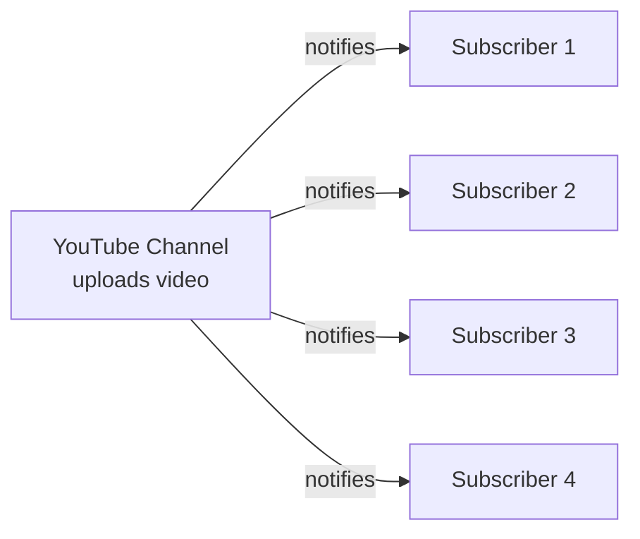
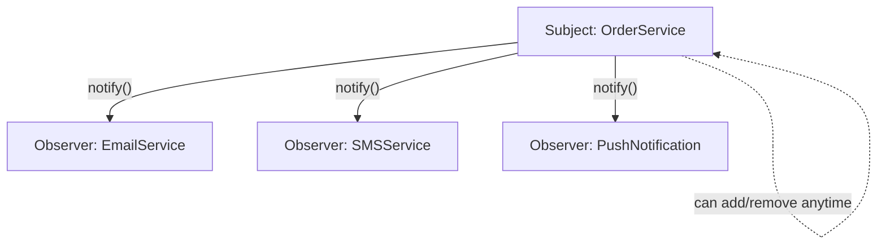
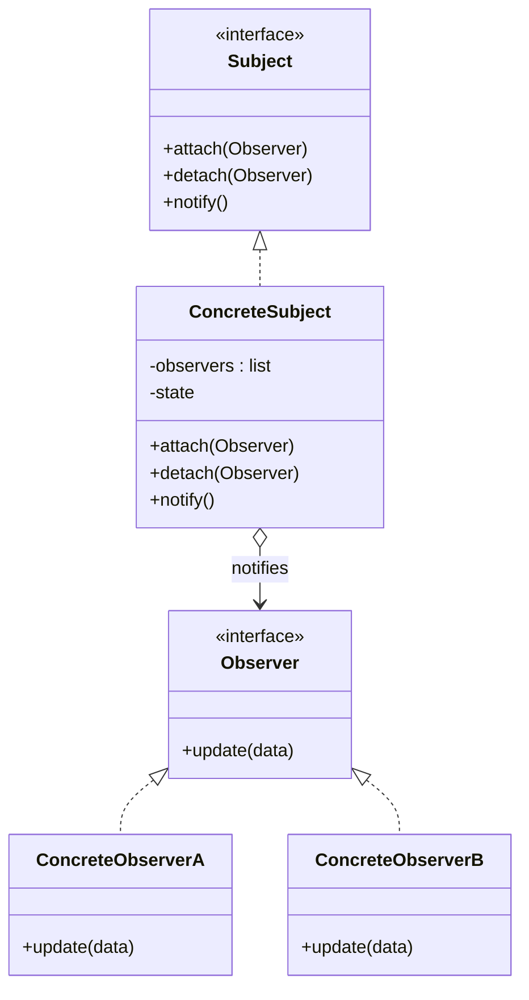
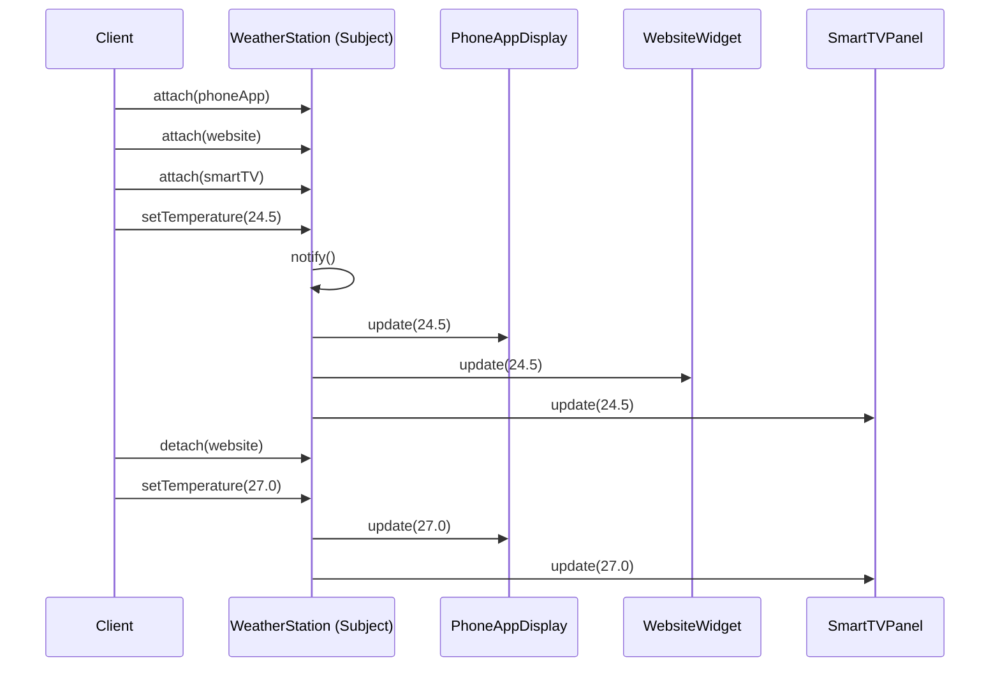
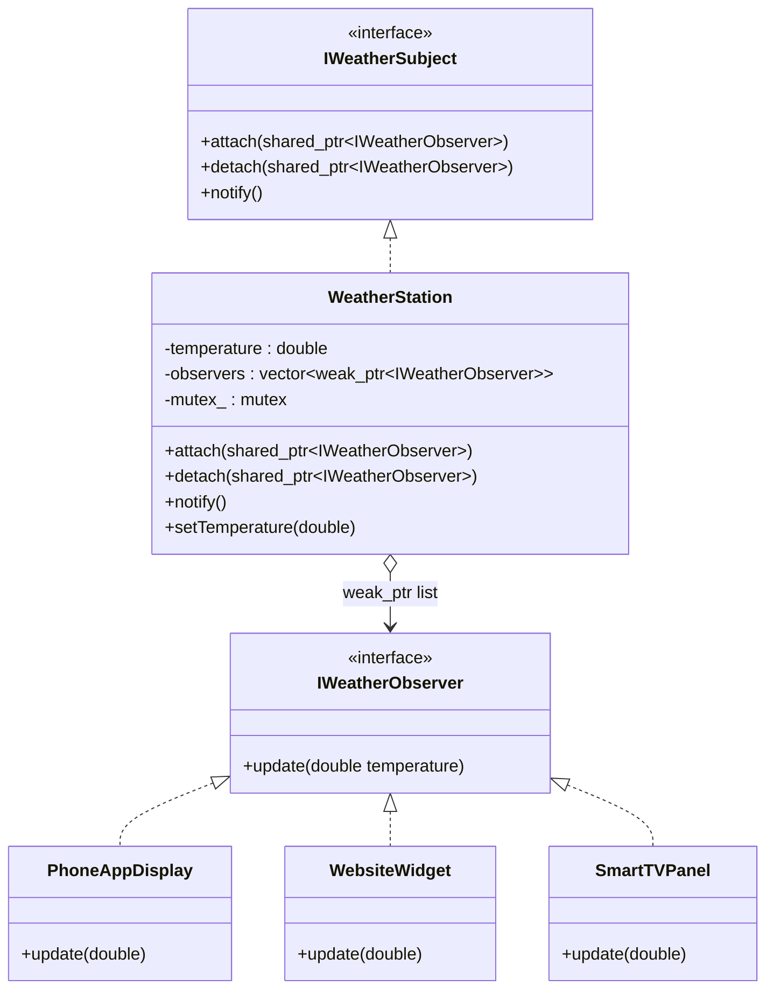

# Understanding the Observer Pattern in Modern C++ — Build Event-Driven Apps

---

## 1. Introduction: Why Do Objects Need to "Talk" to Each Other?

Imagine you build a small app. When an order is placed, you want to:

- send an email
- send an SMS
- show a push notification
- update analytics
- generate an invoice

The easy (but bad) way to do this is to make your `OrderService` directly call every single one of those things itself.

That sounds fine... until you need to add a 6th thing. Then a 7th. Then someone asks you to remove SMS notifications for certain countries. Suddenly your "simple order function" is 300 lines long, and every change to it risks breaking something unrelated.

This is the exact problem the **Observer Pattern** was invented to solve: **how do you let one thing announce "something happened!" without it needing to know — or care — who's listening?**

You'll run into this problem constantly:

- YouTube announcing a new video to millions of subscribers
- A weather station broadcasting a new temperature reading
- A stock ticker updating everyone watching a stock price
- A chat app pushing a new message to every open device

Let's build this up from scratch, the way a mentor would explain it — starting simple, ending production-ready.

---

## 2. A Real-World Analogy: YouTube Subscribers

Think about how YouTube actually works.

- **You (the channel)** don't personally text every subscriber when you upload a video.
- You just click "Publish."
- YouTube has a list of everyone who clicked "Subscribe" on your channel.
- YouTube goes down that list and notifies each subscriber automatically.
- If someone unsubscribes, they simply get removed from that list — you never even notice, and you never had to change your uploading process.

Here's the key insight:

> The **channel (Subject)** doesn't know or care *who* is subscribed, or *how many* there are, or *what they do* with the notification. It just says: "New video is out!" and lets the list handle the rest.

That's the entire Observer Pattern in one sentence: **one object announces a change, and a list of interested objects get told automatically — without the announcer needing to know any details about them.**



---

## 3. The Problem, Without Observer

Let's say we're building the `OrderService` example from the introduction — but the "bad" way, where it directly calls everything.

```cpp
class EmailService {
public:
    void send(const std::string& order) {
        std::cout << "Email sent for order: " << order << "\n";
    }
};

class SMSService {
public:
    void send(const std::string& order) {
        std::cout << "SMS sent for order: " << order << "\n";
    }
};

class OrderService {
public:
    void placeOrder(const std::string& order) {
        std::cout << "Order placed: " << order << "\n";

        // OrderService now has to know about EVERY interested party
        EmailService email;
        email.send(order);

        SMSService sms;
        sms.send(order);

        // Tomorrow: PushNotification, Analytics, Invoice...
        // OrderService keeps growing and growing.
    }
};
```

At first glance, this looks totally reasonable. It even compiles and runs fine. The trouble shows up later.

---

## 4. Why This Becomes a Problem

Let's name the actual pain points, one by one — like a mentor pointing at the code and saying "here's what's going to bite you":

| Problem | What Actually Happens |
|---|---|
| **Tight coupling** | `OrderService` has to `#include` and know about `EmailService`, `SMSService`, and every future service. Change one of their constructors, and `OrderService` might break too. |
| **Difficult testing** | To unit-test `placeOrder()`, you're forced to also trigger real emails and real SMS sends — or build elaborate workarounds. |
| **Code duplication** | Every place that "places an order" (web checkout, mobile checkout, admin panel) has to repeat the same list of calls. |
| **Difficult extension** | Adding a new notification type means opening up and editing `OrderService` again — risky in a class that's already working in production. |
| **Violates Open/Closed Principle** | A class should be *open for extension, but closed for modification*. Here, every new feature means modifying existing, tested code. |

> **⚠️ Warning**
> The moment you find yourself adding a new `if` branch or a new function call to an *already-working* class just to plug in a new "listener," that's a strong signal you need Observer.

---

## 5. Introducing the Observer Pattern

**Definition:** Observer is a design pattern where an object (called the **Subject**, or **Publisher**) maintains a list of dependents (called **Observers**, or **Subscribers**) and automatically notifies them of any state changes — usually by calling one of their methods.

**Intent:** Define a one-to-many relationship between objects so that when one object changes state, all its dependents are notified automatically, without the two sides being tightly bound together.

**Core idea, in plain words:**

> "Don't call *me*, I'll call *you* — if you signed up first."

Instead of `OrderService` reaching out and calling `EmailService`, `SMSService`, etc. directly, it just keeps a *list* of "things that want to know when an order happens." When an order happens, it loops through that list and says "hey, something happened" to each one — without knowing or caring what each one actually does with that information.



---

## 6. The Structure of the Observer Pattern

There are 5 moving parts:

| Role | Job |
|---|---|
| **Subject** (interface) | Declares `attach()`, `detach()`, and `notify()`. Anyone who wants to be "observable" implements this. |
| **Observer** (interface) | Declares one method, usually `update()`, that gets called when something happens. |
| **ConcreteSubject** | The real class holding the actual data/state (e.g., `OrderService`, `WeatherStation`). |
| **ConcreteObserver** | A real class that reacts to updates (e.g., `EmailService`, `TemperatureDisplay`). |
| **Client** | The code that wires everything together — creates the subject, creates observers, and connects them. |



---

## 7. Step-by-Step: The Simplest Possible Implementation

Let's write the smallest version that actually works, and explain every single line — no shortcuts.

```cpp
#include <iostream>
#include <vector>
#include <string>

// 1. The Observer interface — anyone who wants to "listen" must implement this.
class IObserver {
public:
    virtual void update(const std::string& message) = 0; // pure virtual = must override
    virtual ~IObserver() = default;                        // always virtual-destruct base classes
};

// 2. A concrete observer — one specific "listener"
class EmailObserver : public IObserver {
public:
    void update(const std::string& message) override {
        std::cout << "[Email] New order event: " << message << "\n";
    }
};

// 3. Another concrete observer
class SMSObserver : public IObserver {
public:
    void update(const std::string& message) override {
        std::cout << "[SMS] New order event: " << message << "\n";
    }
};

// 4. The Subject — keeps a list of observers and notifies them
class OrderSubject {
public:
    void attach(IObserver* observer) {
        observers.push_back(observer);
    }

    void notifyAll(const std::string& message) {
        for (IObserver* observer : observers) {
            observer->update(message);
        }
    }

private:
    std::vector<IObserver*> observers; // the "subscriber list"
};

int main() {
    OrderSubject orderSubject;

    EmailObserver emailObs;
    SMSObserver smsObs;

    orderSubject.attach(&emailObs); // "subscribe"
    orderSubject.attach(&smsObs);   // "subscribe"

    orderSubject.notifyAll("Order #1234 placed"); // tell everyone at once

    return 0;
}
```

### Line-by-line, like a mentor would explain it

- `class IObserver` — this is the **contract**. It says "if you want to be notified of events, you must have an `update()` method." The `= 0` makes it a *pure virtual function*, meaning `IObserver` itself can never be created directly — only classes that implement `update()` can.
- `virtual ~IObserver() = default;` — this matters more than it looks. If you delete an `EmailObserver` through an `IObserver*` pointer without a virtual destructor, only the base part gets destroyed — a subtle, nasty bug. Always give base classes a virtual destructor.
- `class EmailObserver : public IObserver` — this is a real, usable "subscriber." It fulfills the contract by defining what `update()` actually does.
- `std::vector<IObserver*> observers;` — this is literally YouTube's subscriber list. It doesn't store `EmailObserver` or `SMSObserver` specifically — it stores anything that *is-a* `IObserver`, thanks to polymorphism.
- `attach()` — this is "Subscribe" button logic. Add yourself to the list.
- `notifyAll()` — this is "Publish" button logic. Walk the list, call `update()` on everyone.
- In `main()`, notice `orderSubject` never knows it's talking to an `EmailObserver` or `SMSObserver` specifically — it just sees `IObserver*`. That's the whole trick.

---

## 8. Leveling Up: The Modern C++ Version

The version above works, but it uses raw pointers (`IObserver*`), which creates a classic danger: **what if an observer gets destroyed while the subject still has a pointer to it?** That's a **dangling pointer**, and calling `update()` on it is undefined behavior — it might crash, or worse, silently corrupt memory.

Modern C++ gives us tools to make this safe *by construction*, not by convention.

```cpp
#include <iostream>
#include <vector>
#include <memory>
#include <algorithm>
#include <string>

class IObserver {
public:
    virtual void update(const std::string& message) = 0;
    virtual ~IObserver() = default;
};

class OrderSubject {
public:
    // shared_ptr: subject and client can both "own" the observer safely
    void attach(const std::shared_ptr<IObserver>& observer) {
        observers.push_back(observer); // stored as weak_ptr internally, see below
    }

    void notifyAll(const std::string& message) {
        // Clean out any observers that no longer exist, then notify the rest
        observers.erase(
            std::remove_if(observers.begin(), observers.end(),
                [](const std::weak_ptr<IObserver>& weakObs) {
                    return weakObs.expired(); // true if the real object is gone
                }),
            observers.end());

        for (auto& weakObs : observers) {
            if (auto obs = weakObs.lock()) { // temporarily promote to shared_ptr
                obs->update(message);
            }
        }
    }

private:
    std::vector<std::weak_ptr<IObserver>> observers;
};
```

### Why every choice here matters

- **`std::shared_ptr<IObserver>` for attaching** — the caller (client) keeps real ownership of the observer object. The subject doesn't decide when it lives or dies.
- **`std::weak_ptr<IObserver>` for storing** — this is the star of the show. A `weak_ptr` can *see* an object without *owning* it. If the real `EmailObserver` gets destroyed elsewhere in the program, the `weak_ptr` automatically knows — it doesn't turn into a dangling pointer, it just becomes "expired."
- **`weakObs.expired()`** — this is how we check "does this subscriber even still exist?" before we bother trying to use it.
- **`weakObs.lock()`** — this safely converts a `weak_ptr` back into a temporary `shared_ptr` *only if* the object is still alive, giving you a safe, valid pointer to call `update()` on. If the object is gone, `lock()` returns an empty pointer, and the `if` simply skips it.
- **`std::remove_if` + `erase`** — the classic "erase-remove idiom." We clean out dead subscribers from the list so it doesn't grow forever with expired entries.

> **💡 Tip**
> Think of `weak_ptr` like having someone's *old phone number* written down, versus `shared_ptr` which is like actually *calling them right now and having them pick up*. Before you "call," you check if the number is even still valid.

---

## 9. Complete, Production-Ready Example: A Weather Station

Let's put it all together in a real, compilable, relatable scenario: a **Weather Station** that reports temperature to multiple displays — a phone app, a website widget, and a smart TV panel — each of which formats the data differently.

```cpp
#include <iostream>
#include <vector>
#include <memory>
#include <algorithm>
#include <mutex>
#include <string>

// ---------- Observer interface ----------
class IWeatherObserver {
public:
    virtual void update(double temperatureCelsius) = 0;
    virtual ~IWeatherObserver() = default;
};

// ---------- Subject interface ----------
class IWeatherSubject {
public:
    virtual void attach(const std::shared_ptr<IWeatherObserver>& observer) = 0;
    virtual void detach(const std::shared_ptr<IWeatherObserver>& observer) = 0;
    virtual void notify() = 0;
    virtual ~IWeatherSubject() = default;
};

// ---------- ConcreteSubject ----------
class WeatherStation : public IWeatherSubject {
public:
    void attach(const std::shared_ptr<IWeatherObserver>& observer) override {
        std::lock_guard<std::mutex> lock(mutex_);
        observers.push_back(observer);
    }

    void detach(const std::shared_ptr<IWeatherObserver>& observer) override {
        std::lock_guard<std::mutex> lock(mutex_);
        observers.erase(
            std::remove_if(observers.begin(), observers.end(),
                [&observer](const std::weak_ptr<IWeatherObserver>& w) {
                    auto shared = w.lock();
                    return !shared || shared == observer;
                }),
            observers.end());
    }

    void notify() override {
        // Copy the list under lock, then notify OUTSIDE the lock.
        // This avoids holding a lock while calling into observer code we don't control.
        std::vector<std::weak_ptr<IWeatherObserver>> snapshot;
        {
            std::lock_guard<std::mutex> lock(mutex_);
            snapshot = observers;
        }

        for (auto& weakObs : snapshot) {
            if (auto obs = weakObs.lock()) {
                obs->update(temperature);
            }
        }
    }

    void setTemperature(double newTemp) {
        temperature = newTemp;
        std::cout << "\n[WeatherStation] New reading: " << temperature << " C\n";
        notify(); // state changed -> tell everyone
    }

private:
    double temperature = 0.0;
    std::vector<std::weak_ptr<IWeatherObserver>> observers;
    std::mutex mutex_; // protects the observer list from concurrent attach/detach/notify
};

// ---------- ConcreteObservers ----------
class PhoneAppDisplay : public IWeatherObserver {
public:
    void update(double temperatureCelsius) override {
        std::cout << "[Phone App] It's " << temperatureCelsius << " C right now.\n";
    }
};

class WebsiteWidget : public IWeatherObserver {
public:
    void update(double temperatureCelsius) override {
        double fahrenheit = temperatureCelsius * 9.0 / 5.0 + 32.0;
        std::cout << "[Website Widget] Current temp: " << fahrenheit << " F\n";
    }
};

class SmartTVPanel : public IWeatherObserver {
public:
    void update(double temperatureCelsius) override {
        std::cout << "[Smart TV] Temperature updated: " << temperatureCelsius << " C\n";
    }
};

// ---------- Client ----------
int main() {
    WeatherStation station;

    auto phoneApp = std::make_shared<PhoneAppDisplay>();
    auto website   = std::make_shared<WebsiteWidget>();
    auto smartTV    = std::make_shared<SmartTVPanel>();

    station.attach(phoneApp);
    station.attach(website);
    station.attach(smartTV);

    station.setTemperature(24.5);

    station.detach(website); // website widget unsubscribes
    std::cout << "\n(Website Widget unsubscribed)\n";

    station.setTemperature(27.0);

    return 0;
}
```

---

## 10. Execution Flow: What Actually Happens, Step by Step

1. **Register** — `station.attach(phoneApp)` adds a `weak_ptr` pointing to `phoneApp` into the station's internal list.
2. **Store Observer** — the station now "knows" three observers exist, but owns none of them.
3. **State Change** — `station.setTemperature(24.5)` updates the internal `temperature` value.
4. **Notify** — `notify()` runs, looping through every observer.
5. **Update** — each observer's `update()` is called with the new temperature; each formats/displays it differently.
6. **Unsubscribe** — `station.detach(website)` removes the website widget from the list.
7. **Destroy** — if `smartTV` (the `shared_ptr`) went out of scope entirely, its matching `weak_ptr` inside the station would automatically become "expired" — no dangling pointer, no crash, just silently skipped on the next `notify()`.



---

## 11. Memory Management: Who Owns What?

This is where most Observer implementations go wrong, so let's be very explicit:

- **The client owns the observers** (via `shared_ptr`). The subject should **never** own them.
- **The subject only "watches"** the observers (via `weak_ptr`), the same way a `weak_ptr` lets you check on someone without keeping them alive artificially.
- **Why `weak_ptr` avoids memory leaks:** if the subject held a `shared_ptr` to each observer, and an observer's own code happened to (directly or indirectly) hold a `shared_ptr` back to the subject, you'd get a **circular reference** — neither object's reference count would ever hit zero, and neither would ever be destroyed. That's a memory leak. `weak_ptr` breaks that cycle because it doesn't count as ownership.
- **Dangling pointers**, which plagued the raw-pointer version, simply can't happen with `weak_ptr` — you always check `expired()` or use `lock()` before touching the object.

> **⚠️ Warning**
> If you ever see a Subject storing `std::shared_ptr<IObserver>` (not `weak_ptr`), ask yourself: "who is really supposed to own this object's lifetime?" Usually, it should be the client — not the thing broadcasting events.

---

## 12. Thread Safety

If multiple threads can call `attach()`, `detach()`, or `notify()` at the same time (very common in real systems — think multiple publishers pushing sensor data, and multiple UI threads subscribing/unsubscribing), you need synchronization.

Notice in the Weather Station example:

- A `std::mutex mutex_` protects the observer list itself.
- `attach()` and `detach()` take a `std::lock_guard<std::mutex>` before touching the list.
- `notify()` takes a **snapshot** (a copy) of the observer list *while locked*, then releases the lock **before** calling any observer's `update()`.

> **⚠️ Warning**
> Never call an observer's `update()` while still holding your internal lock. If that observer's code tries to call back into the subject (say, to `detach()` itself), you'll deadlock — the thread will be waiting on a lock it's already holding. This is a very real, very common production bug.

In genuinely large systems, you might go further — using a dedicated event queue, a thread pool for dispatching notifications, or a message broker — but the core rule stays the same: **protect the shared list, and never hold a lock while calling into code you don't control.**

---

## 13. Advantages

- ✅ **Loose coupling** — the Subject doesn't need to know concrete observer types, just the interface.
- ✅ **Open/Closed Principle respected** — add a new observer type without touching the Subject's code at all.
- ✅ **Dynamic relationships** — observers can subscribe and unsubscribe at runtime, not just at compile time.
- ✅ **Broadcast communication** — one event, many independent reactions, with zero duplicated logic.
- ✅ **Testability** — you can attach a fake/mock observer in a unit test to verify the Subject fires the right events, without needing real email/SMS services.

## 14. Disadvantages

- ❌ **Notification order isn't guaranteed** in most implementations — don't build logic that depends on Observer A being notified before Observer B unless you explicitly design for it.
- ❌ **Debugging is harder** — a bug caused by a chain of notify → update → notify → update calls can be tricky to trace compared to a simple, direct function call.
- ❌ **Memory/lifetime management adds complexity** — as we saw, getting ownership right (shared_ptr vs weak_ptr) takes real care.
- ❌ **Over-notification** — if not designed carefully, observers can get flooded with updates they don't actually care about, wasting CPU cycles.
- ❌ **Hidden performance cost** — a "simple" state change can silently trigger a cascade of expensive operations across many observers.

---

## 15. When NOT to Use Observer

- When there's genuinely only **one** listener and it will likely always stay that way — a direct function call or a simple callback (`std::function`) is simpler and easier to trace.
- When you need a **guaranteed response** back from the notified party (Observer is fundamentally fire-and-forget/one-way).
- When strict **ordering** between multiple handlers matters a lot — consider an explicit pipeline/chain instead.
- When the "events" are actually just steps in a **single well-defined workflow** — a Mediator or a plain sequence of function calls may be clearer than scattering logic across many observers.

---

## 16. Real-World Uses

| Domain | Example |
|---|---|
| **GUI Frameworks** | Button click handlers, form validation listeners |
| **Qt** | Signals & Slots — essentially a built-in, type-safe Observer implementation |
| **Game Engines** | Achievement systems reacting to "player leveled up" events |
| **Stock Market Platforms** | Live price tickers pushing updates to thousands of watchers |
| **Chat Applications** | New-message events pushed to all connected devices |
| **IoT Systems** | Sensor readings broadcast to dashboards, alarms, and loggers simultaneously |
| **Linux Event Systems** | `inotify`, udev — kernel-level "something changed" notifications |
| **Medical Devices** | Vital-sign monitors notifying multiple displays and alarm systems at once |
| **Event Buses** | Decoupled microservice-style communication within a single application |
| **Logging/Telemetry** | One log call, multiple sinks (console, file, remote server) reacting independently |

---

## 17. Common Interview Questions

> **🎯 Interview Question**
> *"Why does Observer promote loose coupling?"*
> **Answer:** Because the Subject only depends on an abstract `IObserver` interface, not on any concrete class. New observer types can be added without modifying the Subject at all.

> **🎯 Interview Question**
> *"What's the difference between Observer and Publish/Subscribe (Pub/Sub)?"*
> **Answer:** Classic Observer has a direct reference between Subject and Observer (even if it's just a `weak_ptr`) — they're aware of each other's interface. Pub/Sub typically adds a middle layer (a message broker/event bus), so publishers and subscribers never know about each other at all, often across process or network boundaries.

> **🎯 Interview Question**
> *"What's the difference between a callback and Observer?"*
> **Answer:** A callback (e.g., `std::function`) is usually a single function registered for a single event on a single object. Observer formalizes this into a full pattern supporting *multiple* observers, a consistent interface, and explicit attach/detach lifecycle management.

> **🎯 Interview Question**
> *"Can Observer create memory leaks? How do you prevent it?"*
> **Answer:** Yes, if the Subject holds `shared_ptr`s to observers and a cycle forms. Using `weak_ptr` in the Subject's storage breaks that cycle.

> **🎯 Interview Question**
> *"Is Observer thread-safe by default?"*
> **Answer:** No — you must explicitly protect the observer list (e.g., with a `std::mutex`) if attach/detach/notify can happen from multiple threads concurrently.

> **🎯 Interview Question**
> *"Why use `weak_ptr` instead of raw pointers for observers?"*
> **Answer:** Raw pointers can dangle if the observer is destroyed while the subject still references it. `weak_ptr` safely detects when the observed object no longer exists via `expired()`/`lock()`, without risking undefined behavior.

---

## 18. Common Mistakes

1. **Forgetting to unsubscribe** — leaving stale references around, wasting cycles notifying dead/irrelevant observers.
2. **Circular references** via `shared_ptr` on both sides, leading to memory leaks.
3. **Using raw pointers** for observer storage, risking dangling-pointer crashes.
4. **Holding a lock while notifying** — a fast path to deadlocks if an observer calls back into the subject.
5. **Modifying the observer list during notification** — e.g., an observer's `update()` calls `detach()` on the very list you're currently iterating, corrupting the loop. (Solved above by notifying from a *snapshot* copy.)

---

## 19. Comparison Table

| Pattern | Coupling | Direction | Typical Scope | Best For |
|---|---|---|---|---|
| **Observer** | Loose (via interface) | One-to-many, direct reference | Single process/module | State-change notification within an app |
| **Callback** | Very loose (single function) | One-to-one | Anywhere | Simple "do this when X happens" |
| **Pub/Sub** | Very loose (via broker) | Many-to-many, indirect | Distributed systems | Decoupled services, microservices |
| **Mediator** | Centralizes coupling into one hub | Many-to-many via mediator | Single module | Coordinating complex interactions between many objects |
| **Event Bus** | Loose (via bus/queue) | Many-to-many | App-wide or distributed | Decoupled, app-wide broadcast events |
| **Signals & Slots (Qt)** | Loose (type-safe) | One-to-many | GUI/App framework | Language/framework-native Observer implementation |

---

## 20. Best Practices

- Prefer `std::weak_ptr` for observer storage in the Subject; let the client own observers via `std::shared_ptr`.
- Take a **snapshot** of the observer list before notifying, so you never iterate a list that could change mid-loop.
- Protect the observer list with a `std::mutex` if multiple threads can attach/detach/notify concurrently — and never hold that lock while calling an observer's method.
- Always give interface base classes a `virtual` destructor.
- Keep `update()` signatures minimal and purposeful — pass just the data observers actually need, not the entire internal state of the Subject.
- Consider `std::function`-based observers for simple, lightweight cases where a full class hierarchy is overkill.
- Document whether notification order is guaranteed — and if it isn't, don't let any observer secretly depend on it.

---

## 21. Complete UML Diagram



---

## 22. Expected Console Output

```
[WeatherStation] New reading: 24.5 C
[Phone App] It's 24.5 C right now.
[Website Widget] Current temp: 76.1 F
[Smart TV] Temperature updated: 24.5 C

(Website Widget unsubscribed)

[WeatherStation] New reading: 27 C
[Phone App] It's 27 C right now.
[Smart TV] Temperature updated: 27 C
```

---

## 23. Complexity Analysis

| Operation | Cost |
|---|---|
| **Registration (`attach`)** | O(1) amortized — appending to a `std::vector` |
| **Removal (`detach`)** | O(n) — scanning the vector to find and erase the matching entry |
| **Notification (`notify`)** | O(n) — one `update()` call per observer, plus O(n) to copy the snapshot |
| **Memory** | O(n) for the observer list itself; each `weak_ptr` is small and doesn't keep the observer alive |

---

## 24. FAQ

**Q: Do I need `shared_ptr`/`weak_ptr` for every Observer implementation?**
No — for simple, single-threaded, short-lived scenarios, raw pointers or references can be fine if you're disciplined about lifetimes. But in any real, long-lived application, `weak_ptr` is the safer default.

**Q: Can an object be both a Subject and an Observer at the same time?**
Yes — this is common in event-chain systems, where one component reacts to an event and then fires its own event onward.

**Q: What data should `update()` pass — the full state, or just what changed?**
Prefer passing only what changed when possible. It keeps observers simpler and avoids leaking unnecessary internal details of the Subject.

**Q: Is `std::function` a good alternative to a formal `IObserver` interface?**
For lightweight cases, yes — a `std::vector<std::function<void(double)>>` can replace a whole interface hierarchy. It's simpler but loses the ability to easily "detach by identity" unless you add extra bookkeeping (like an ID).

**Q: Does the Observer pattern require inheritance?**
No — it requires *some* consistent way to call observers, which can be inheritance-based polymorphism (shown here) or purely function-based (`std::function`), depending on your needs.

**Q: What happens if `notify()` is called but there are zero observers?**
Nothing — the loop simply does nothing. This is one of the pattern's strengths: the Subject never has to check "does anyone care?" first.

**Q: Should `notify()` be called automatically inside every setter?**
Not always — sometimes you want to batch several state changes and notify once at the end, for efficiency. Design this deliberately rather than by default.

**Q: Can Observer be combined with Pub/Sub?**
Yes — many real systems use classic Observer *within* a module, and a Pub/Sub event bus *between* modules or services.

**Q: How is Observer different from the Chain of Responsibility pattern?**
Chain of Responsibility passes a request along a chain until *one* handler deals with it and typically stops. Observer notifies *all* observers, and none of them are expected to "consume" or stop the notification.

**Q: Is Qt's Signals & Slots literally the Observer pattern?**
Conceptually, yes — it's a type-safe, framework-integrated implementation of the same core idea: one signal, many connected slots (observers), fired automatically.

---

## 25. Key Takeaways

- Observer solves **one-to-many notification** without tight coupling between the announcer and the listeners.
- The Subject depends only on an **interface**, never on concrete observer classes.
- Use `shared_ptr` for **ownership** (by the client) and `weak_ptr` for **observation** (by the Subject) to avoid dangling pointers *and* memory leaks from reference cycles.
- Thread safety must be handled explicitly — protect the list, and never notify while holding your lock.
- Take a **snapshot** before notifying to avoid corrupting the list if an observer modifies it mid-notification.
- It's a foundational pattern behind GUI frameworks, Qt's Signals & Slots, game engines, IoT systems, and event-driven architecture in general.

---

## 26. Conclusion

The Observer Pattern isn't some abstract academic idea — it's the same logic behind YouTube subscriptions, weather apps, and stock tickers, just written in C++. Once you see the pattern once, you'll start noticing it everywhere: anytime "one thing happens, and several unrelated things need to react," Observer (or one of its cousins — Pub/Sub, Event Bus, Signals & Slots) is quietly doing the work.

The best way to really understand it isn't just reading this article — it's building your own version. Try extending the Weather Station example: add a `MinMaxTracker` observer that keeps a running highest/lowest temperature, or a `AlertObserver` that only reacts when the temperature crosses a threshold. You'll quickly feel *why* this pattern earns its place in every serious C++ developer's toolkit.

*Have you used Observer (or Qt's Signals & Slots) in a real project? What tripped you up the first time — ownership, threading, or something else? Drop it in the comments — I read every one.*

---
---
