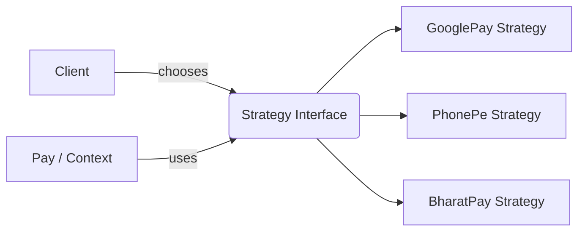
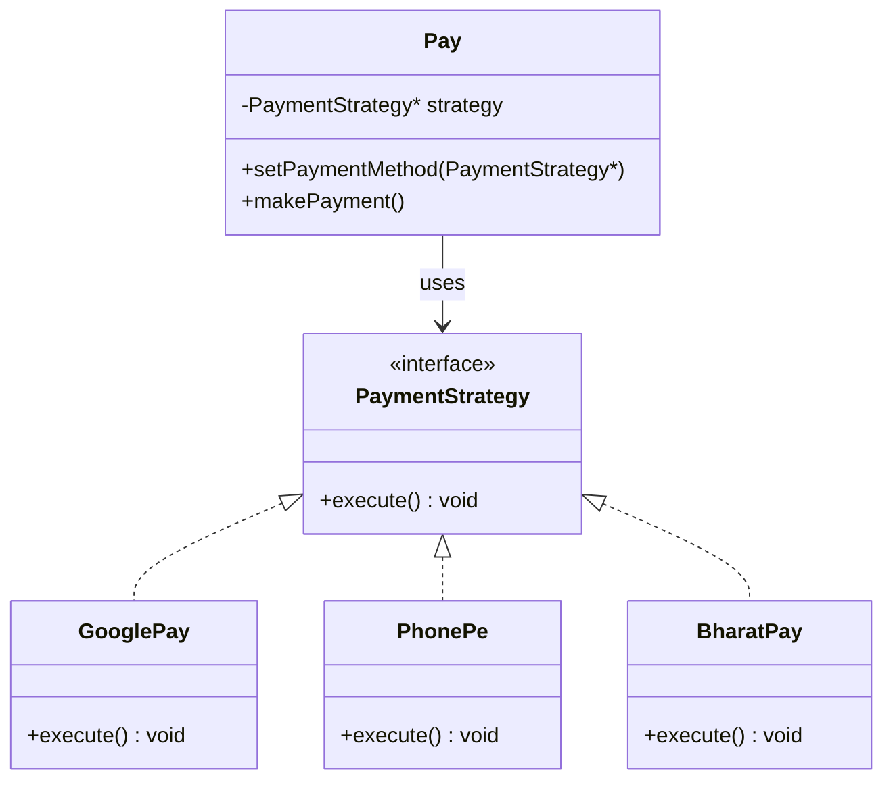
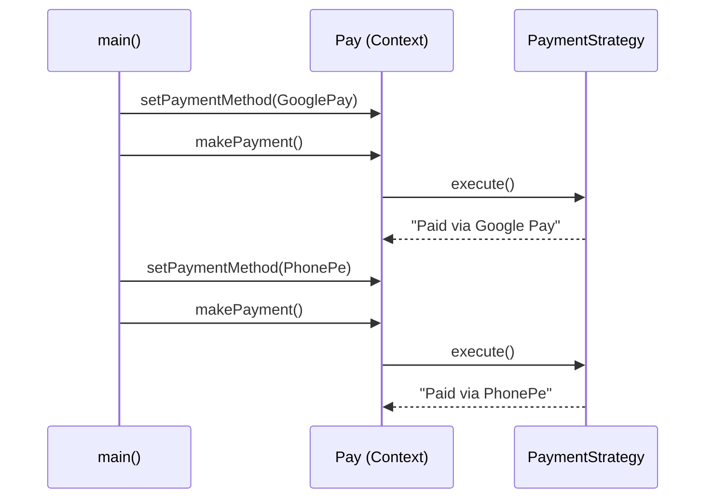

# Strategy Pattern in Modern C++ — Stop Writing if-else Ladders, Start Writing Swappable Behavior

> "Don't tell an object *how* to do something in twenty different ways inside one function. Give it a *strategy*, and let it decide."

---

## 1. Introduction — Why Does This Pattern Even Exist?

Imagine you're building a payment system for an app like Amazon or Flipkart. A user can pay using **Google Pay**, **PhonePe**, **BharatPay**, a **Credit Card**, or **Cash on Delivery**.

The "quick and dirty" way most beginners write this looks like:

```cpp
void makePayment(std::string method, double amount) {
    if (method == "googlepay") {
        std::cout << "Paying via Google Pay...\n";
    } else if (method == "phonepe") {
        std::cout << "Paying via PhonePe...\n";
    } else if (method == "bharatpay") {
        std::cout << "Paying via BharatPay...\n";
    } else if (method == "creditcard") {
        std::cout << "Paying via Credit Card...\n";
    }
    // ...and it keeps growing forever
}
```

This works fine — for about a week. Then your product manager says "add Paytm support," then "add Apple Pay," then "add UPI-Lite," and this one function turns into a 300-line monster that everyone is scared to touch.

**The Strategy Pattern exists to kill this monster.**

Its whole idea, in one sentence:

> **Instead of writing "if this, do that" inside one giant function, put each "way of doing something" into its own small class, and let the object swap between them at runtime.**

That's it. That's the entire pattern. Everything else in this article is just showing you *how* to do that cleanly in C++.

---

## 2. Real-World Analogy — Planning a Trip

Forget code for a second. Think about how **you** travel from Pune to Mumbai.

Depending on your mood, budget, and urgency, you might choose:

- 🚌 **Bus** — cheap, slow, comfortable enough
- 🚆 **Train** — moderate price, scenic, reliable
- ✈️ **Flight** — expensive, fastest
- 🚗 **Own Car** — flexible, but tiring

Notice something important: **the goal never changes** — "travel from Pune to Mumbai" — but **the strategy to achieve that goal changes** depending on the situation.

You don't redesign the concept of "travelling" every time you pick a different vehicle. You just **plug in a different mode of transport** into the same trip.

That is *exactly* what the Strategy Pattern does in software:

| Real Life | Software |
|---|---|
| The trip (Pune → Mumbai) | The `Traveler` class (the "context") |
| Bus / Train / Flight / Car | Different `TravelStrategy` implementations |
| You choosing a vehicle | Calling `setStrategy()` at runtime |
| Actually travelling | Calling `travel()` — same call, different behavior |

> 💡 **Tip Box:** A good way to recognize "this needs a Strategy Pattern" is when you hear yourself say **"same goal, different way of doing it."** Payment methods, sorting algorithms, compression algorithms, discount rules, travel modes — all "same goal, different way."

---

## 3. The Problem — Life Without Strategy Pattern

Let's go back to our payment example and see why the "if-else" version becomes painful in a real production app.

```cpp
class Pay {
public:
    void makePayment(std::string method) {
        if (method == "googlepay") {
            std::cout << "USER DONE PAYMENT USING GOOGLE PAY...\n";
        } else if (method == "phonepe") {
            std::cout << "USER DONE PAYMENT USING PHONE PAY...\n";
        } else if (method == "bharatpay") {
            std::cout << "USER DONE PAYMENT USING BHARAT PAY...\n";
        }
        // Add Paytm? Add another else-if.
        // Add Apple Pay? Add another else-if.
        // Add UPI International? Add another else-if.
    }
};
```

### Why This Becomes a Nightmare

- ❌ **Violates Open/Closed Principle** — every new payment method forces you to *open* and *edit* this function, when it should stay closed for modification.
- ❌ **Hard to test** — to test "GooglePay logic," you must run the whole `makePayment` function and hope the right branch executes.
- ❌ **Hard to reuse** — if another class also needs "GooglePay logic," you either copy-paste the code or extract a helper awkwardly.
- ❌ **Grows without limit** — 5 payment methods today, 20 tomorrow. The function becomes unreadable.
- ❌ **Risk of bugs** — one wrong `else if` condition can silently break an unrelated payment method.

> ⚠️ **Warning Box:** A function with more than 4–5 `else if` branches doing *different behaviors* (not just different values) is almost always a sign that a Strategy Pattern is missing.

---

## 4. Introducing the Strategy Pattern

### Definition

> The **Strategy Pattern** defines a family of interchangeable algorithms (or behaviors), encapsulates each one in its own class, and lets the client swap between them at runtime — without changing the code that uses them.

### Core Idea in Plain English

- You have a **task** (e.g., "make a payment", "travel somewhere", "sort a list").
- There are **multiple ways** to do that task.
- Instead of `if-else`, each way becomes its **own class**.
- All these classes follow the **same contract** (an interface).
- The object performing the task holds a **pointer/reference to that contract**, and doesn't care which specific class is behind it.



---

## 5. Structure of the Strategy Pattern

There are always **three roles**:

| Role | Meaning | In Our Example |
|---|---|---|
| **Strategy** (interface) | Declares the common behavior all strategies must implement | `PaymentStrategy` |
| **Concrete Strategy** | Each actual implementation of that behavior | `GooglePay`, `PhonePe`, `BharatPay` |
| **Context** | The class that *uses* a strategy, without knowing which one exactly | `Pay` |



---

## 6. Step-by-Step Basic Implementation (Payment Example)

Let's build this from scratch, one small piece at a time.

### Step 1 — Define the Strategy Interface

```cpp
class PaymentStrategy {
public:
    virtual void execute() = 0;   // pure virtual -> every strategy MUST implement this
    virtual ~PaymentStrategy() = default; // always give interfaces a virtual destructor
};
```

**Why?** This is the *contract*. It says: "Whatever payment method you are, you must know how to `execute()` yourself." The `Pay` class will only ever talk to this interface — never to the concrete classes directly.

### Step 2 — Create Concrete Strategies

```cpp
class GooglePay : public PaymentStrategy {
public:
    void execute() override {
        std::cout << "USER DONE PAYMENT USING GOOGLE PAY...\n";
    }
};

class PhonePe : public PaymentStrategy {
public:
    void execute() override {
        std::cout << "USER DONE PAYMENT USING PHONE PE...\n";
    }
};

class BharatPay : public PaymentStrategy {
public:
    void execute() override {
        std::cout << "USER DONE PAYMENT USING BHARAT PAY...\n";
    }
};
```

**Why?** Each class handles **one and only one** way of paying. If GooglePay's logic changes tomorrow, you edit *only* `GooglePay` — nothing else in the system is touched. That's the whole point.

### Step 3 — Create the Context

```cpp
class Pay {
private:
    PaymentStrategy* strategy = nullptr;

public:
    void setPaymentMethod(PaymentStrategy* p) {
        strategy = p;
    }

    void makePayment() {
        if (strategy) {
            strategy->execute();
        } else {
            std::cout << "No payment method selected!\n";
        }
    }
};
```

**Why?** `Pay` doesn't know or care *which* payment method it's holding. It only knows "I have *some* `PaymentStrategy`, and I can call `execute()` on it." This is the magic — **polymorphism replaces `if-else`.**

### Step 4 — Use It

```cpp
int main() {
    Pay payObj;

    GooglePay gpay;
    PhonePe ppay;
    BharatPay bpay;

    payObj.setPaymentMethod(&gpay);
    payObj.makePayment();     // USER DONE PAYMENT USING GOOGLE PAY...

    payObj.setPaymentMethod(&ppay);
    payObj.makePayment();     // USER DONE PAYMENT USING PHONE PE...

    payObj.setPaymentMethod(&bpay);
    payObj.makePayment();     // USER DONE PAYMENT USING BHARAT PAY...

    return 0;
}
```

Notice: **`payObj.makePayment()` never changes.** Only *what's plugged into it* changes. That's the entire trick.

---

## 7. Modern C++ Version (No Raw Pointers, No Manual Memory Management)

Raw pointers (`PaymentStrategy*`) work, but modern C++ prefers safer, self-managing tools:

- `std::unique_ptr` / `std::shared_ptr` instead of raw `new`/`delete`
- `std::function` when you don't even need a class hierarchy for very simple strategies
- `override` and `= default` for clarity and safety

```cpp
#include <iostream>
#include <memory>
#include <string>

class PaymentStrategy {
public:
    virtual void execute(double amount) const = 0;
    virtual ~PaymentStrategy() = default;
};

class GooglePay : public PaymentStrategy {
public:
    void execute(double amount) const override {
        std::cout << "Paid Rs." << amount << " using Google Pay\n";
    }
};

class PhonePe : public PaymentStrategy {
public:
    void execute(double amount) const override {
        std::cout << "Paid Rs." << amount << " using PhonePe\n";
    }
};

class BharatPay : public PaymentStrategy {
public:
    void execute(double amount) const override {
        std::cout << "Paid Rs." << amount << " using BharatPay\n";
    }
};

class Pay {
private:
    std::unique_ptr<PaymentStrategy> strategy;

public:
    void setPaymentMethod(std::unique_ptr<PaymentStrategy> p) {
        strategy = std::move(p);
    }

    void makePayment(double amount) const {
        if (strategy) {
            strategy->execute(amount);
        } else {
            std::cout << "Please select a payment method first!\n";
        }
    }
};

int main() {
    Pay payObj;

    payObj.setPaymentMethod(std::make_unique<GooglePay>());
    payObj.makePayment(499.0);

    payObj.setPaymentMethod(std::make_unique<PhonePe>());
    payObj.makePayment(1250.0);

    payObj.setPaymentMethod(std::make_unique<BharatPay>());
    payObj.makePayment(75.0);

    return 0;
}
```

### Why These Changes Matter

| Old Version | New Version | Why It's Better |
|---|---|---|
| `PaymentStrategy* strategy` | `std::unique_ptr<PaymentStrategy> strategy` | No manual `delete`, no memory leaks |
| Global raw objects (`gobj`, `bobj`) | `std::make_unique<GooglePay>()` | Ownership is clear — `Pay` owns the strategy |
| `void execute()` | `void execute(double amount) const` | Real strategies usually need input; `const` marks it as non-mutating |
| No `override` keyword | `override` everywhere | Compiler catches typos in function signatures |

> ✅ **Best Practice Callout:** Use `std::unique_ptr` when only the `Context` owns the strategy. Use `std::shared_ptr` only if the *same* strategy object must be shared across multiple contexts (rare for Strategy Pattern).

---

## 8. Second Real-World Example — Travel Strategy (Because Two Examples Beat One)

This one is even easier to picture: **choosing how to travel from Pune to Mumbai.**

```cpp
#include <iostream>
#include <memory>

// The Strategy interface
class TravelStrategy {
public:
    virtual void travel() const = 0;
    virtual ~TravelStrategy() = default;
};

// Concrete strategies
class BusTravel : public TravelStrategy {
public:
    void travel() const override {
        std::cout << "Travelling by Bus: cheap, takes ~5 hours.\n";
    }
};

class TrainTravel : public TravelStrategy {
public:
    void travel() const override {
        std::cout << "Travelling by Train: comfortable, takes ~3.5 hours.\n";
    }
};

class FlightTravel : public TravelStrategy {
public:
    void travel() const override {
        std::cout << "Travelling by Flight: fastest, takes ~1 hour.\n";
    }
};

// The Context
class Traveler {
private:
    std::unique_ptr<TravelStrategy> strategy;

public:
    void setTravelMode(std::unique_ptr<TravelStrategy> t) {
        strategy = std::move(t);
    }

    void startJourney() const {
        if (strategy) {
            strategy->travel();
        } else {
            std::cout << "No travel mode selected!\n";
        }
    }
};

int main() {
    Traveler person;

    std::cout << "-- Weekday, in a hurry --\n";
    person.setTravelMode(std::make_unique<FlightTravel>());
    person.startJourney();

    std::cout << "-- Weekend, relaxed --\n";
    person.setTravelMode(std::make_unique<TrainTravel>());
    person.startJourney();

    std::cout << "-- Tight budget --\n";
    person.setTravelMode(std::make_unique<BusTravel>());
    person.startJourney();

    return 0;
}
```

**Expected Output:**

```
-- Weekday, in a hurry --
Travelling by Flight: fastest, takes ~1 hour.
-- Weekend, relaxed --
Travelling by Train: comfortable, takes ~3.5 hours.
-- Tight budget --
Travelling by Bus: cheap, takes ~5 hours.
```

Same `Traveler`, same `startJourney()` call — three completely different behaviors, chosen at runtime. **That's the whole pattern, proven twice.**

> 🎓 **Explain-to-a-12-year-old summary:** "The `Traveler` doesn't know how to travel by itself. It just says 'go!' to whatever travel plan you handed it. You can hand it a bus plan, a train plan, or a flight plan — the traveler doesn't care, it just follows whichever plan it's holding."

---

## 9. Execution Flow — What Actually Happens Step by Step

1. **Define the contract** — create the abstract `Strategy` class with one pure virtual method.
2. **Implement variations** — write one small class per behavior (`GooglePay`, `BusTravel`, etc.).
3. **Give the context a slot** — the `Context` (`Pay`, `Traveler`) stores a pointer/`unique_ptr` to the strategy.
4. **Inject the strategy** — the client (your `main()`, or a config file, or user input) decides *which* strategy to plug in, and calls `setStrategy(...)`.
5. **Delegate the call** — the context calls `strategy->execute()`/`strategy->travel()` without knowing the concrete type.
6. **Swap anytime** — call `setStrategy(...)` again with a different object, and behavior changes instantly — no `if-else`, no recompilation of the context class.



---

## 10. When NOT to Use Strategy Pattern

The Strategy Pattern is powerful, but not free — a full class hierarchy is overkill for trivial cases.

- 🚫 If you only have **2 fixed behaviors that will never grow**, a simple `bool` flag or a plain `if-else` is fine.
- 🚫 If the "strategy" is just **one line of logic**, use a `std::function` or a lambda instead of a whole class hierarchy.
- 🚫 If behaviors need to share a **lot of internal state** with the context, Strategy Pattern can lead to awkward back-and-forth data passing — consider **Template Method Pattern** instead.

```cpp
// Sometimes this is all you need — no classes required:
std::function<void(double)> strategy = [](double amt) {
    std::cout << "Paid Rs." << amt << " using UPI\n";
};
strategy(199.0);
```

---

## 11. Advantages

| Advantage | Why It Matters |
|---|---|
| **Open/Closed Principle** | Add a new payment method or travel mode without touching existing code |
| **Easy to test** | Each strategy class can be unit tested in isolation |
| **Eliminates if-else chains** | Cleaner, more readable context class |
| **Runtime flexibility** | Behavior can change while the program is running |
| **Reusable** | The same strategy class can be reused across multiple contexts |

## 12. Disadvantages

| Disadvantage | Why It Matters |
|---|---|
| **More classes** | Every behavior needs its own class — more files to manage |
| **Client must know strategies** | Someone has to decide *which* strategy to inject — that logic goes somewhere |
| **Overkill for simple cases** | Two fixed behaviors rarely justify a full hierarchy |

---

## 13. Real-World Uses

- 💳 **Payment gateways** (GooglePay, PhonePe, Cards, Wallets)
- 🧮 **Sorting algorithms** (`std::sort` with custom comparators is a Strategy in disguise!)
- 🗺️ **Navigation apps** (fastest route vs shortest route vs avoid tolls)
- 🎮 **Game AI** (aggressive strategy vs defensive strategy vs passive strategy)
- 🗜️ **Compression tools** (ZIP vs RAR vs 7z algorithms)
- 💰 **Discount/pricing engines** (festive discount vs loyalty discount vs bulk discount)

> 💡 **Tip Box:** Anywhere you pass a **function or comparator** into a library function (like `std::sort(v.begin(), v.end(), myComparator)`), you're already using the Strategy Pattern — just in its lightweight, functional form.


## 14. Common Mistakes

- ❌ Putting shared logic inside each concrete strategy instead of a common base/helper — leads to duplication.
- ❌ Forgetting a `virtual` destructor in the base `Strategy` class — causes undefined behavior when deleting through a base pointer.
- ❌ Letting the `Context` "peek" at the concrete strategy type (e.g., `dynamic_cast`) — defeats the purpose of the pattern.
- ❌ Creating a new strategy class for every tiny variation instead of parameterizing one class — leads to class explosion.

---

## 15. Comparison Table

| Pattern | Purpose | Who Decides Behavior |
|---|---|---|
| **Strategy** | Swap interchangeable algorithms | Client, at setup/runtime |
| **State** | Object changes behavior as its internal state changes | The object itself |
| **Template Method** | Fixed skeleton, customizable steps | Subclass, at compile time |
| **Command** | Encapsulate a request as an object | Client, for queuing/undo |
| **Factory** | Create objects without specifying exact class | Client, at creation time |

---

## 16. Best Practices

- ✅ Always give the `Strategy` base class a **virtual destructor**.
- ✅ Prefer `std::unique_ptr` for ownership unless sharing is genuinely required.
- ✅ Keep each strategy **stateless or self-contained** — avoid strategies that secretly depend on the context's internals.
- ✅ For very simple, one-line behaviors, prefer `std::function`/lambdas over full class hierarchies.
- ✅ Name strategies by **what they do**, not how they're implemented (`FastestRoute`, not `AlgorithmA`).

---

## 17. Complexity Analysis

| Operation | Complexity |
|---|---|
| Selecting a strategy | O(1) |
| Executing a strategy | O(1) at the context level (actual cost depends on the strategy's own logic) |
| Adding a new strategy | O(1) — just add a new class, zero changes to existing code |

---

## 18. Key Takeaways

- Strategy Pattern replaces **conditional logic** with **polymorphism**.
- The **Context** never needs to know which concrete strategy it's using.
- New behaviors = new classes, **not** new `if-else` branches.
- Modern C++ makes this safer with `std::unique_ptr`, `override`, and `std::function`.
- Recognize it by the phrase: **"same goal, different way of doing it."**

---

## 19. Conclusion

The Strategy Pattern is one of the simplest yet most practical design patterns you'll ever use. It doesn't require complex machinery — just one interface, a handful of small classes, and a context that trusts those classes to do their job.

Next time you catch yourself writing a long `if-else` or `switch` chain that picks between different *behaviors* (not just different *values*), stop and ask: **"Could each branch become its own class instead?"** If yes — you've just found a Strategy Pattern waiting to be built.

Try it yourself: pick something in your own project with 3+ ways of doing the same task, and refactor it into a Strategy Pattern this week.
